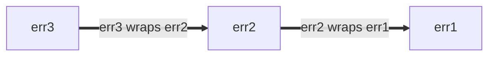

<!--* toc_depth: 3 *-->

# Go Stili En İyi Uygulamalar

best-practices

[Gözden geçirme](index) | [Kılavuz](guide) | [Kararlar](decisions) |
[En iyi uygulamalar](best-practices)

<!--

-->

**Not:** Bu, Google'da [Go Stili](index)'ni özetleyen belge serisinin bir
parçasıdır. Bu belge ne [normatif](index#normative) ne de
[kanonik](index#canonical)dir ve [ana stil kılavuzu](guide)'na yardımcı bir
belgedir. Daha fazla bilgi için [gözden geçirmeye](index#about) bakın.

## Hakkında

Bu dosya, **Go Stil Kılavuzu'nun en iyi nasıl uygulanacağına ilişkin
yönergeleri** belgelemektedir. Bu yönergeler sık sık ortaya çıkan yaygın
durumlar için tasarlanmıştır ancak her durumda geçerli olmayabilir. Mümkün
olduğunda, ne zaman uygulanacağı ve ne zaman uygulanmayacağına ilişkin kararla
ilişkin hususlar da dahil olmak üzere birden fazla alternatif yaklaşım ele
alınmaktadır.

Tüm Stil Kılavuzu belgeleri için [gözden geçirmeye](index#about) bakın.

## İsimlendirme

### Fonksiyon ve metod isimleri

#### Tekrardan kaçının

Bir fonksiyon veya metod için isim seçerken, ismin okunacağı bağlamı göz
önünde bulundurun. Çağrı sitesinde aşırı [tekrar](decisions#repetition)'dan
kaçınmak için aşağıdaki önerileri değerlendirin:

- Aşağıdakiler genellikle fonksiyon ve metod isimlerinden çıkarılabilir:

  - Girdi ve çıktıların türleri (çakışma olmadığında)
  - Bir metodun alıcısının türü
  - Bir girdinin veya çıktının pointer olup olmadığı

- Fonksiyonlar için [paket ismini](decisions#repetitive-with-package)
  tekrarlamayın.

  ```go
  // Kötü:
  package yamlconfig

  func ParseYAMLConfig(input string) (*Config, error)
  ```

  ```go
  // İyi:
  package yamlconfig

  func Parse(input string) (*Config, error)
  ```

- Metodlar için metod alıcısının ismini tekrarlamayın.

  ```go
  // Kötü:
  func (c *Config) WriteConfigTo(w io.Writer) (int64, error)
  ```

  ```go
  // İyi:
  func (c *Config) WriteTo(w io.Writer) (int64, error)
  ```

- Parametre olarak geçirilen değişkenlerin isimlerini tekrarlamayın.

  ```go
  // Kötü:
  func OverrideFirstWithSecond(dest, source *Config) error
  ```

  ```go
  // İyi:
  func Override(dest, source *Config) error
  ```

- Dönen değerlerin isimlerini ve türlerini tekrarlamayın.

  ```go
  // Kötü:
  func TransformToJSON(input *Config) *jsonconfig.Config
  ```

  ```go
  // İyi:
  func Transform(input *Config) *jsonconfig.Config
  ```

Benzер isimli fonksiyonları birbirinden ayırt etmeniz gerektiğinde, ek
bilgi eklemek kabul edilebilir.

```go
// İyi:
func (c *Config) WriteTextTo(w io.Writer) (int64, error)
func (c *Config) WriteBinaryTo(w io.Writer) (int64, error)
```

#### İsimlendirme kuralları

Fonksiyon ve metod isimleri seçerken bazı diğer yaygın kurallar vardır:

- Bir şey döndüren fonksiyonlara isim gibi isimler verilir.

  ```go
  // İyi:
  func (c *Config) JobName(key string) (value string, ok bool)
  ```

  Bunun bir sonucu olarak, fonksiyon ve metod isimlerinin
  [`Get` ön ekinden](decisions#getters) kaçınması gerekir.

  ```go
  // Kötü:
  func (c *Config) GetJobName(key string) (value string, ok bool)
  ```

- Bir şey yapan fonksiyonlara fiil gibi isimler verilir.

  ```go
  // İyi:
  func (c *Config) WriteDetail(w io.Writer) (int64, error)
  ```

- Yalnızca ilgili türler farklı olan özdeş fonksiyonlar, ismin sonuna türün
  ismini ekler.

  ```go
  // İyi:
  func ParseInt(input string) (int, error)
  func ParseInt64(input string) (int64, error)
  func AppendInt(buf []byte, value int) []byte
  func AppendInt64(buf []byte, value int64) []byte
  ```

  Açıkça bir "birincil" sürüm varsa, o sürüm için tür ismi atlanabilir:

  ```go
  // İyi:
  func (c *Config) Marshal() ([]byte, error)
  func (c *Config) MarshalText() (string, error)
  ```

### Test double ve yardımcı paketleri

Test yardımcılarını ve özellikle [test double]'ları sağlayan paket ve türleri
[isimlendirme](guide#naming) için uygulayabileceğiniz birkaç kural vardır.
Bir test double bir stub, fake, mock veya spy olabilir.

Bu örnekler çoğunlukla stub'lar kullanır. Kodunuz fake veya başka bir test
double türü kullanıyorsa isimlerinizi buna göre güncelleyin.

[naming]: guide#naming
[test doubles]: https://abseil.io/resources/swe-book/html/ch13.html#basic_concepts

Örneğin, aşağıdaki gibi production kodu sağlayan iyi odaklı bir paketiniz
olsun:

```go
package creditcard

import (
    "errors"

    "path/to/money"
)

// ErrDeclined, ihraççının ücretlendirmeyi reddettiğini belirtir.
var ErrDeclined = errors.New("creditcard: declined")

// Card, ihraççı, son kullanma tarihi ve limit gibi bir kredi kartına
// ilişkin bilgileri içerir.
type Card struct {
    // atlandı
}

// Service, charge, authorize, reimburse ve subscribe gibi harici ödeme
// işleyici satıcılara karşı kredi kartlarıyla işlemler yapmanızı sağlar.
type Service struct {
    // atlandı
}

func (s *Service) Charge(c *Card, amount money.Money) error { /* atlandı */ }
```

#### Yardımcı test paketleri oluşturma

Başka bir paket için test double'ları içeren bir paket oluşturmak
istediğinizi varsayalım. Bu örnek için yukarıdaki `package creditcard`
paketini kullanacağız:

Bir yaklaşım, test için production paketine dayalı yeni bir Go paketi
sunmaktır. Güvenli bir seçim, orijinal paket isminin sonuna `test` eklemektir
("creditcard" + "test"):

```go
// İyi:
package creditcardtest
```

Aşağıdaki bölümlerde açıkça belirtilmediği sürece, tüm örnekler
`package creditcardtest` içindedir.

#### Basit durum

`Service` için bir grup test double eklemek istiyorsunuz. `Card`, bir Protocol
Buffer mesajına benzer şekilde etkin olarak basit bir veri türü olduğundan,
testlerde özel bir işleme gerek yoktur, dolayısıyla bir double'a gerek
yoktur. Yalnızca bir tür (örneğin `Service`) için test double'ları
öngörüyorsanız, double'ları isimlendirmede kısa bir yaklaşım
kullanabilirsiniz:

```go
// İyi:
import (
    "path/to/creditcard"
    "path/to/money"
)

// Stub, creditcard.Service'i stub'lar ve kendi davranışını sunmaz.
type Stub struct{}

func (Stub) Charge(*creditcard.Card, money.Money) error { return nil }
```

Bu, `StubService` veya çok kötü olan `StubCreditCardService` gibi bir
isimlendirmeye kesinlikle tercih edilir, çünkü temel paket ismi ve ilgili
türleri `creditcardtest.Stub`'un ne olduğunu ima eder.

Son olarak, paket Bazel ile oluşturuluyorsa, paket için yeni `go_library`
kuralının `testonly` olarak işaretlendiğinden emin olun:

```build
# İyi:
go_library(
    name = "creditcardtest",
    srcs = ["creditcardtest.go"],
    deps = [
        ":creditcard",
        ":money",
    ],
    testonly = True,
)
```

Yukarıdaki yaklaşım gelenekseldir ve diğer mühendisler tarafından makul
ölçüde iyi anlaşılacaktır.

Ayrıca bakın:

- [Go İpucu #42: Test İçin Stub Oluşturma](index#gotip)

#### Çoklu test double davranışları

Bir stub türü yeterli olmadığında (örneğin, her zaman başarısız olan bir
stub'a da ihtiyacınız varsa), stub'ları taklit ettikleri davranışa göre
isimlendirmenizi öneriyoruz. Burada `Stub`'u `AlwaysCharges` olarak
yeniden adlandırıyoruz ve `AlwaysDeclines` adında yeni bir stub sunuyoruz:

```go
// İyi:
// AlwaysCharges, creditcard.Service'i stub'lar ve başarı simüle eder.
type AlwaysCharges struct{}

func (AlwaysCharges) Charge(*creditcard.Card, money.Money) error { return nil }

// AlwaysDeclines, creditcard.Service'i stub'lar ve reddedilen
// ücretlendirmeleri simüle eder.
type AlwaysDeclines struct{}

func (AlwaysDeclines) Charge(*creditcard.Card, money.Money) error {
    return creditcard.ErrDeclined
}
```

#### Çoklu türler için çoklu double'lar

Ancak şimdi `package creditcard`'ın, aşağıda `Service` ve `StoredValue`
olarak görüldüğü gibi, double oluşturmayı değer kılan birden fazla tür
içerdiğini varsayalım:

```go
package creditcard

type Service struct {
    // atlandı
}

type Card struct {
    // atlandı
}

// StoredValue, müşteri kredi bakiyelerini yönetir. Bu, iade edilen
// ürünlerin kredi ihraççısı tarafından işlenmek yerine müşterinin yerel
// hesabına kredilendirildiğinde geçerlidir. Bu nedenle ayrı bir hizmet
// olarak uygulanmıştır.
type StoredValue struct {
    // atlandı
}

func (s *StoredValue) Credit(c *Card, amount money.Money) error { /* atlandı */ }
```

Bu durumda, daha açıklayıcı test double isimlendirmesi mantıklıdır:

```go
// İyi:
type StubService struct{}

func (StubService) Charge(*creditcard.Card, money.Money) error { return nil }

type StubStoredValue struct{}

func (StubStoredValue) Credit(*creditcard.Card, money.Money) error { return nil }
```

#### Testlerdeki yerel değişkenler

Testlerdeki değişkenleriniz double'lara atıfta bulunduğunda, bağlama göre
double'ı diğer production türlerinden en açık şekilde ayırt eden bir isim
seçin. Test etmek istediğiniz bazı production kodlarını düşünün:

```go
package payment

import (
    "path/to/creditcard"
    "path/to/money"
)

type CreditCard interface {
    Charge(*creditcard.Card, money.Money) error
}

type Processor struct {
    CC CreditCard
}

var ErrBadInstrument = errors.New("payment: instrument is invalid or expired")

func (p *Processor) Process(c *creditcard.Card, amount money.Money) error {
    if c.Expired() {
        return ErrBadInstrument
    }
    return p.CC.Charge(c, amount)
}
```

Testlerde, `CreditCard` için "spy" adlı bir test double ile production
türleri yan yana gelir, bu yüzden isim ön eki eklemek netliği artırabilir.

```go
// İyi:
package payment

import "path/to/creditcardtest"

func TestProcessor(t *testing.T) {
    var spyCC creditcardtest.Spy
    proc := &Processor{CC: spyCC}

    // tanımlamalar atlandı: card ve amount
    if err := proc.Process(card, amount); err != nil {
        t.Errorf("proc.Process(card, amount) = %v, want nil", err)
    }

    charges := []creditcardtest.Charge{
        {Card: card, Amount: amount},
    }

    if got, want := spyCC.Charges, charges; !cmp.Equal(got, want) {
        t.Errorf("spyCC.Charges = %v, want %v", got, want)
    }
}
```

Bu, isim ön eklenmediğinden daha nettir.

```go
// Kötü:
package payment

import "path/to/creditcardtest"

func TestProcessor(t *testing.T) {
    var cc creditcardtest.Spy

    proc := &Processor{CC: cc}

    // tanımlamalar atlandı: card ve amount
    if err := proc.Process(card, amount); err != nil {
        t.Errorf("proc.Process(card, amount) = %v, want nil", err)
    }

    charges := []creditcardtest.Charge{
        {Card: card, Amount: amount},
    }

    if got, want := cc.Charges, charges; !cmp.Equal(got, want) {
        t.Errorf("cc.Charges = %v, want %v", got, want)
    }
}
```

### Gölgeleme

**Not:** Bu açıklama iki gayri resmi terim kullanır: _ezme_ ve _gölgeleme_.
Bunlar Go dil spesifikasyonundaki resmi kavramlar değildir.

Birçok programlama dilinde olduğu gibi, Go'da da değiştirilebilir değişkenler
vardır: bir değişkene değer atamak onun değerini değiştirir.

```go
// İyi:
func abs(i int) int {
    if i < 0 {
        i *= -1
    }
    return i
}
```

`:=` operatörü ile [kısa değişken tanımlamaları](guide#variable-declarations)
kullanırken, bazı durumlarda yeni bir değişken oluşturulmaz. Buna _ezme_
diyebiliriz. Orijinal değere artık ihtiyaç duyulmadığında bunu yapmak
sorunsuzdur.

```go
// İyi:
// innerHandler, diğer arka uçlara istekler gönderen bir istek
// işleyicisi için yardımcıdır.
func (s *Server) innerHandler(ctx context.Context, req *pb.MyRequest) *pb.MyResponse {
    // Bu istek işleme bölümü için süreyi koşulsuz olarak sınırla.
    ctx, cancel := context.WithTimeout(ctx, 3*time.Second)
    defer cancel()
    ctxlog.Info(ctx, "Capped deadline in inner request")

    // Buradaki kod artık orijinal bağlama erişemez.
    // Bu iyi bir stilltir, eğer ilk yazdığınızda, kod büyüdükçe bile
    // hiçbir işlemin çağrıcının sağladığı (muhtemelen sınırsız)
    // orijinal bağlamı meşru şekilde kullanmaması gerektiğini
    // öngörüyorsanız.

    // ...
}
```

Ancak yeni bir kapsamda kısa değişken tanımlamaları kullanırken dikkatli
olun: bu yeni bir değişken oluşturur. Buna orijinal değişkeni
_gölgeleme_ diyebiliriz. Bloğun sonundaki kod orijinal değişkene atıfta
bulunur. Süreyi koşullu olarak kısaltmaya yönelik hatalı bir deneme
şudur:

```go
// Kötü:
func (s *Server) innerHandler(ctx context.Context, req *pb.MyRequest) *pb.MyResponse {
    // Süreyi koşullu olarak sınırlamaya çalışır.
    if *shortenDeadlines {
        ctx, cancel := context.WithTimeout(ctx, 3*time.Second)
        defer cancel()
        ctxlog.Info(ctx, "Capped deadline in inner request")
    }

    // HATA: Buradaki "ctx" tekrar çağrıcının sağladığı bağlamdır.
    // Yukarıdaki hatalı kod derlendi, çünkü ctx ve cancel her ikisi de
    // if ifadesinin içinde kullanıldı.

    // ...
}
```

Kodun doğru bir versiyonu şu olabilir:

```go
// İyi:
func (s *Server) innerHandler(ctx context.Context, req *pb.MyRequest) *pb.MyResponse {
    if *shortenDeadlines {
        var cancel func()
        // Basit atama, = ve := kullanımı not edin.
        ctx, cancel = context.WithTimeout(ctx, 3*time.Second)
        defer cancel()
        ctxlog.Info(ctx, "Capped deadline in inner request")
    }
    // ...
}
```

Ezme olarak adlandırdığımız durumda, yeni bir değişken olmadığından,
atanan tür orijinal değişkenin türüyle eşleşmelidir. Gölgeleme ile tamamen
yeni bir varlık tanıtılır, dolayısıyla farklı bir türe sahip olabilir.
Kasıtlı gölgeleme faydalı bir uygulama olabilir, ancak
[açıklığı](guide#clarity) artırıyorsa her zaman yeni bir isim
kullanabilirsiniz.

Standart paketlerle aynı isimde değişkenleri çok küçük kapsamlar dışında
kullanmak iyi bir fikir değildir, çünkü bu o paketten gelen serbest
fonksiyonları ve değerleri erişilemez hale getirir. Tersine, paketiniz için
bir isim seçerken, [içe aktarma yeniden adlandırma](decisions#import-renaming)
gerektirme ihtimali olan veya müşteri tarafında iyi olan değişken isimlerinin
gölgelenmesine yol açma ihtimali olan isimlerden kaçının.

```go
// Kötü:
func LongFunction() {
    url := "https://example.com/"
    // Hata, artık aşağıdaki kodda net/url kullanamayız.
}
```

[kısa değişken tanımlamaları]: https://go.dev/ref/spec#Short_variable_declarations

### Yardımcı paketler

Go paketlerinin `package` bildiriminde belirtilen, import yolundan ayrı bir
ismi vardır. Paket ismi, yola kıyasla okunabilirlik açısından daha önemlidir.

Go paket isimleri [paketin ne sağladığıyla](decisions#package-names) ilgili
olmalıdır. Bir paketi yalnızca `util`, `helper`, `common` veya benzeri olarak
adlandırmak genellikle kötü bir seçimdir (ismin _bir parçası_ olarak
kullanılabilir). Bilgi verici olmayan isimler kodu okumayı zorlaştırır ve çok
geniş kullanılırlarsa gereksiz [içe aktarma çakışmalarına](decisions#import-renaming) yol açabilir.

Bunun yerine, çağrı sitesinin nasıl görüneceğini düşünün.

```go
// İyi:
db := spannertest.NewDatabaseFromFile(...)

_, err := f.Seek(0, io.SeekStart)

b := elliptic.Marshal(curve, x, y)
```

Import listesini bilmeseniz bile bunların ne yaptığını yaklaşık olarak
anlayabilirsiniz (`cloud.google.com/go/spanner/spannertest`, `io` ve
`crypto/elliptic`). Daha az odaklı isimlerle şunlar gibi okunabilir:

```go
// Kötü:
db := test.NewDatabaseFromFile(...)

_, err := f.Seek(0, common.SeekStart)

b := helper.Marshal(curve, x, y)
```

## Paket boyutu

Go paketlerinizin ne kadar büyük olması ve ilgili türleri aynı pakete mi
yerleştireceğinizi yoksa farklı paketlere mi böleceğinizi merak ediyorsanız,
başlamak için iyi bir yer [paket isimleri hakkında Go blog
yazısı][blog-pkg-names]'dır. Yazı başlığına rağmen, yalnızca isimlendirme
hakkında değildir. Bazı faydalı ipuçları içerir ve birkaç yararlı makale ve
sunuma atıfta bulunur.

Bazı diğer hususlar ve notlar şunlardır:

Kullanıcılar paket için [godoc]'u tek bir sayfada görür ve paket tarafından
sağlanan türlerin dışa aktardığı tüm metodlar türüne göre gruplandırılır.
Godoc, ayrıca return edilen türlerle birlikte constructor'ları da
gruplandırır. Eğer _istemci kodu_, iki farklı türün birbiriyle etkileşim
girmesini gerektiriyorsa, kullanıcı için bunları aynı pakette bulundurmak
kullanışlı olabilir.

Bir paket içindeki kod, paketteki dışa aktarılmamış tanımlayıcılara erişebilir.
Uygulaması sıkı bir şekilde bağlı birkaç ilgili türünüz varsa, bunları aynı
pakete yerleştirmek, bu ayrıntıları public API'yi kirletmeden elde etmenizi
sağlar. Bu bağ için iyi bir test, iki paketin yakın ilişkili konuları kapsadığı
varsayımsal bir kullanıcı hayal etmektir: eğer kullanıcı her iki paketi de
anlamlı bir şekilde kullanmak için her ikisini de import etmek zorundaysa,
bunları birleştirmek genellikle yapılacak doğru şeydir. Standart kütüphane
genellikle bu tür kapsamlandırma ve katmanlamayı iyi gösterir.

Tüm bunlara rağmen, tüm projenizi tek bir pakete koymak muhtemelen o paketi çok
büyük yapar. Bir şey kavramsal olarak farklı olduğunda, ona kendi küçük
paketsini vermek kullanmayı kolaylaştırabilir. Müşteriler tarafından bilinen
paketin kısa ismi ile dışa aktarılan tür ismi birlikte anlamlı bir tanım
oluşturur: örneğin `bytes.Buffer`, `ring.New`. [Paket İsimleri blog
yazısı][blog-pkg-names]更多 örnekler içermektedir.

Go stili dosya boyutu konusunda esnektir, çünkü bakımcılar bir paket içindeki
kodları bir dosyadan diğerine taşıyabilir ve bu çağrıları etkilemez. Ancak
genel bir kılavuz olarak: tek bir dosyada binlerce satır bulundurmak veya çok
küçük dosyalar oluşturmak genellikle iyi bir fikir değildir. Bazı diğer dillerdeki
gibi "bir tür, bir dosya" kuralı yoktur. Kural olarak, dosyalar yeterince odaklı
olmalıdır ki bakımcı bir şeyin hangi dosyada olduğunu anlayabilsin ve dosyalar
yeterince küçük olmalıdır ki orada bulmak kolay olsun. Standart kütüphane genellikle
büyük paketleri birkaç kaynak dosyasına böler, ilgili kodu dosyaya göre
gruplandırarak. [Paket `bytes`][package `bytes`] kaynak kodu iyi bir örnektir.
Uzun paket belgelerine sahip paketler, yalnızca [paket belgesini](decisions#package-comments),
bir paket bildirimini ve başka hiçbir şeyi içeren `doc.go` adlı bir dosya
ayrımaya seçebilirler, ancak bu zorunlu değildir.

Google kod tabanında ve Bazel kullanan projelerde, Go kodu için dizin düzeni
açık kaynak Go projelerinden farklıdır: tek bir dizinde birden fazla
`go_library` hedefi bulunabilir. Her pakete kendi dizinini vermenin iyi bir
nedeni, projenizi gelecekte açık kaynak yapmayı planlıyorsanızdır.

Bu fikirleri eylemde göstermeye yardımcı olacak birkaç kanonik olmayan
örnek:

- Tek bir tutarlı fikir içeren ve daha fazla eklenmeye veya çıkarılmaya
  değer görülmeyen küçük paketler:

  - [Paket `csv`][package `csv`]: CSV veri kodlama ve kod çözümü, sorumluluk
    sırasıyla [reader.go] ve [writer.go] arasında bölünmüştür.
  - [Paket `expvar`][package `expvar`]: Tümü [expvar.go] içinde yer alan
    beyaz kutu program telemetrisi.

- Tek bir büyük alanı ve birden fazla sorumluluğunu birlikte içeren
  orta boy paketler:

  - [Paket `flag`][package `flag`]: Tümü [flag.go] içinde yer alan
    komut satırı flag yönetimi.

- Birçok ilişkili alanı birkaç dosya arasında bölen büyük paketler:

  - [Paket `http`][package `http`]: HTTP'nin çekirdeği:
    [client.go][http-client], HTTP istemcileri için destek;
    [server.go][http-client], HTTP sunucuları için destek;
    [cookie.go], çerez yönetimi.
  - [Paket `os`][package `os`]: Çapraz platform işletim sistemi soyutlamaları:
    [exec.go], alt süreç yönetimi; [file.go], dosya yönetimi;
    [tempfile.go], geçici dosyalar.

Ayrıca bakın:

- [Test double paketleri](#naming-doubles)
- [Go Kodunu Düzenleme (Blog Yazısı)]
- [Go Kodunu Düzenleme (Sunum)]

[blog-pkg-names]: https://go.dev/blog/package-names
[package `bytes`]: https://go.dev/src/bytes/
[Go Kodunu Düzenleme (Blog Yazısı)]: https://go.dev/blog/organizing-go-code
[Go Kodunu Düzenleme (Sunum)]: https://go.dev/talks/2014/organizeio.slide
[package `csv`]: https://pkg.go.dev/encoding/csv
[reader.go]: https://go.googlesource.com/go/+/refs/heads/master/src/encoding/csv/reader.go
[writer.go]: https://go.googlesource.com/go/+/refs/heads/master/src/encoding/csv/writer.go
[package `expvar`]: https://pkg.go.dev/expvar
[expvar.go]: https://go.googlesource.com/go/+/refs/heads/master/src/expvar/expvar.go
[package `flag`]: https://pkg.go.dev/flag
[flag.go]: https://go.googlesource.com/go/+/refs/heads/master/src/flag/flag.go
[godoc]: https://pkg.go.dev/
[package `http`]: https://pkg.go.dev/net/http
[http-client]: https://go.googlesource.com/go/+/refs/heads/master/src/net/http/client.go
[http-server]: https://go.googlesource.com/go/+/refs/heads/master/src/net/http/server.go
[cookie.go]: https://go.googlesource.com/go/+/refs/heads/master/src/net/http/cookie.go
[package `os`]: https://pkg.go.dev/os
[exec.go]: https://go.googlesource.com/go/+/refs/heads/master/src/os/exec.go
[file.go]: https://go.googlesource.com/go/+/refs/heads/master/src/os/file.go
[tempfile.go]: https://go.googlesource.com/go/+/refs/heads/master/src/os/tempfile.go

## Importlar

### Protocol Buffer Mesajları ve Stub'ları

Proto library importları, diller arası doğaları nedeniyle standart Go
importlarından farklı ele alınır. Yeniden adlandırılan proto importları için
gelenek, paketi oluşturan kurala dayanır:

- `pb` eki genellikle `go_proto_library` kuralları için kullanılır.
- `grpc` eki genellikle `go_grpc_library` kuralları için kullanılır.

Genellikle paketi tanımlayan tek bir kelime kullanılır:

```go
// İyi:
import (
    foopb "path/to/package/foo_service_go_proto"
    foogrpc "path/to/package/foo_service_go_grpc"
)
```

[Paket isimleri](decisions#package-names)
kılavuzuna uyun. Bütün kelimeleri tercih edin. Kısa isimler iyidir ancak
belirsizlikten kaçının. Emin olmadığınızda, _go'ya kadar olan proto paket
ismini pb ekiyle kullanın:

```go
// İyi:
import (
    pushqueueservicepb "path/to/package/push_queue_service_go_proto"
)
```

**Not:** Önceki yönerge "xpb" veya hatta yalnızca "pb" gibi çok kısa isimleri
teşvik ediyordu. Yeni kod daha açıklayıcı isimleri tercih etmelidir. Kısa
isimler kullanan mevcut kod örnek olarak kullanılmamalıdır, ancak
değiştirilmesi gerekmez.

### Import sıralaması

[Go Stil Kararları: Import gruplandırma](decisions.md#import-grouping)'a bakın.

## Hata yönetimi

Go'da [hatalar değerdir](https://go.dev/blog/errors-are-values); kod tarafından
oluşturulur ve kod tarafından tüketilir. Hatalar şunlar olabilir:

- İnsanlara görüntülenmek üzere tanı bilgisine dönüştürülebilir
- Bakımcı tarafından kullanılabilir
- Son kullanıcı tarafından yorumlanabilir

Hata mesajları ayrıca günlük mesajları, hata dökümleri ve oluşturulmuş
arayüzler dahil olmak üzere çeşitli farklı yüzeylerde görünür.

Hataları işleyen (üreten veya tüketen) kod bunu bilinçli olarak yapmalıdır.
Bir hata dönüş değerini görmezden gelmek veya körüklemek cazip gelebilir.
Ancak, çağrının mevcut fonksiyonunun hatayı en etkili şekilde ele almak için
konumlandırılıp konumlandırılmadığını düşünmeye her zaman değer. Bu geniş bir
konudur ve kesin tavsiye vermek zordur. Yargınızı kullanın, ancak aşağıdaki
hususları aklınızda tutun:

- Bir hata değeri oluştururken, ona bir [yapı](#error-structure) verip
  vermeyeceğinize karar verin.
- Bir hatayı işlerken, çağrıya ve/veya alıcıya sunulmayan mevcut bilgiyi
  [eklemeyi](#error-extra-info) düşünün.
- Ayrıca [hata günlükleme](#error-logging) yönergelerine bakın.

Bir hatayı görmezden gelmek genellikle uygun olmasa da, bunun makul bir
istisnası, genellikle yalnızca ilk hatanın faydalı olduğu ilişkili
işlemleri orkestre ettiğiniz durumdur. [`errgroup`] paketi, hepsi aynı anda
başarısız olabilen veya iptal edilebilen bir grup işlem için kullanışlı bir
soyutlama sağlar.

[`errgroup`]: https://pkg.go.dev/golang.org/x/sync/errgroup

Ayrıca bakın:

- [Etkili Go'da hatalar](https://go.dev/doc/effective_go#errors)
- [Go Blog'dan hatalar hakkında bir yazı](https://go.dev/blog/go1.13-errors)
- [Paket `errors`](https://pkg.go.dev/errors)
- [Paket `upspin.io/errors`](https://commandcenter.blogspot.com/2017/12/error-handling-in-upspin.html)
- [Goİpucu #89: Kanonik Durum Kodlarını Hata Olarak Ne Zaman Kullanmalı](index#gotip)
- [Goİpucu #48: Hata Beklenen Değerleri](index#gotip)
- [Goİpucu #13: Kontrol İçin Hataları Tasarlama](index#gotip)

### Hata yapısı

Çağrıcıların hatayı sorgulaması gerekiyorsa (örneğin, farklı hata koşullarını
ayrırt etmek), hata değerine yapı verin ki bu programatik olarak
yapılabilsin ve çağrı yapanın dize eşleştirmesi yapması gerekmektedir.
Bu tavsiye, farklı hata koşullarını önemseyen testlerin yanı sıra production
koduna da uygulanır.

En basit yapılandırılmış hatalar parametresiz globally değerlerdir.

```go
type Animal string

var (
    // ErrDuplicate, bu hayvan daha önce görüldüğünde oluşur.
    ErrDuplicate = errors.New("duplicate")

    // ErrMarsupial, Avustralya dışındaki keselilerden alerjimiz
    // olduğu için oluşur. Özür dileriz.
    ErrMarsupial = errors.New("marsupials are not supported")
)

func process(animal Animal) error {
    switch {
    case seen[animal]:
        return ErrDuplicate
    case marsupial(animal):
        return ErrMarsupial
    }
    seen[animal] = true
    // ...
    return nil
}
```

Çağrı yapan, fonksiyonun dönen hata değerini bilinen hata değerlerinden
biriyle karşılaştırabilir:

```go
// İyi:
func handlePet(...) {
    switch err := process(an); err {
    case ErrDuplicate:
        return fmt.Errorf("feed %q: %v", an, err)
    case ErrMarsupial:
        // Bir arkadaşla kurtulmayı deneyin.
        alternate = an.BackupAnimal()
        return handlePet(..., alternate, ...)
    }
}
```

Yukarıda beklenen değerle (`==` anlamında) eşleşmesi gereken beklenen
değerler kullanılmıştır. Bu birçok durumda tamamen yeterlidir. Eğer
`process` sarılmış hatalar döndürüyorsa (aşağıda tartışılacaktır),
[`errors.Is`] kullanabilirsiniz.

```go
// İyi:
func handlePet(...) {
    switch err := process(an); {
    case errors.Is(err, ErrDuplicate):
        return fmt.Errorf("feed %q: %v", an, err)
    case errors.Is(err, ErrMarsupial):
        // ...
    }
}
```

Hataları dize biçimlerine göre ayırt etmeye çalışmayın. (Daha fazla bilgi için
[Go İpucu #13: Kontrol İçin Hataları Tasarlama](index#gotip)
adlı makaleye bakın.)

```go
// Kötü:
func handlePet(...) {
    err := process(an)
    if regexp.MatchString(`duplicate`, err.Error()) {...}
    if regexp.MatchString(`marsupial`, err.Error()) {...}
}
```

Hata içinde çağrıcının programatik olarak ihtiyaç duyduğu ek bilgi varsa, bu
ideally yapısal olarak sunulmalıdır. Örneğin, [`os.PathError`] türü,
başarısız işlemin yol adını çağrıcının kolayca erişebileceği bir yapı alanına
yerleştirecek şekilde belgelenmiştir.

Diğer hata yapıları uygun şekilde kullanılabilir, örneğin bir hata kodu ve
detay dizesi içeren bir proje yapısı. [Paket `status`][status] yaygın bir
kapsamalamadır; bu yaklaşımı seçerseniz (bunu yapmak zorunda değilsiniz),
[kanonik kodları](decisions#canonical-codes) kullanın. Durum kodlarını
kullanmanın doğru seçim olup olmadığını öğrenmek için
[Go İpucu #89: Kanonik Durum Kodlarını Hata Olarak Ne Zaman Kullanmalı](index#gotip)'a
bakın.

[`os.PathError`]: https://pkg.go.dev/os#PathError
[`errors.Is`]: https://pkg.go.dev/errors#Is
[`errors.As`]: https://pkg.go.dev/errors#As
[`package cmp`]: https://pkg.go.dev/github.com/google/go-cmp/cmp
[status]: https://pkg.go.dev/google.golang.org/grpc/status
[canonical codes]: https://pkg.go.dev/google.golang.org/grpc/codes

### Hatalara bilgi ekleme

Hatalara bilgi eklerken, temel haldeki hatanın zaten sağladığı gereksiz
bilgiden kaçının. Örneğin `os` paketi, hatalarında zaten yol bilgisi
içerir.

```go
// İyi:
if err := os.Open("settings.txt"); err != nil {
  return fmt.Errorf("launch codes unavailable: %v", err)
}

// Çıktı:
//
// launch codes unavailable: open settings.txt: no such file or directory
```

Burada, "launch codes unavailable" ifadesi, `os.Open` hatasına mevcut
fonksiyonun bağlamıyla ilgili anlamlı bir anlam katar, ancak temel dosya
yolu bilgisini tekrarlamaz.

```go
// Kötü:
if err := os.Open("settings.txt"); err != nil {
  return fmt.Errorf("could not open settings.txt: %v", err)
}

// Çıktı:
//
// could not open settings.txt: open settings.txt: no such file or directory
```

Yalnızca yeni bilgi eklemeden bir başarısızlığı göstermeyi amaçlayan bir
not eklemeyin. Bir hata varlığı, başarısızlığı çağrıya yeterince iletir.

```go
// Kötü:
return fmt.Errorf("failed: %v", err) // bunun yerine doğrudan err döndürün
```

Sarılmış hatalarda `%v` ve `%w` arasındaki
[seçim](https://go.dev/blog/go1.13-errors#whether-to-wrap), hataların
uygulamanız içinde nasıl yayıldığını, işlendiğini, incelendiğini ve
belgelendiğini önemli ölçüde etkileyen nüanslı bir karardır. Temel ilke,
hata değerlerini gözlemcileri için kullanışlı yapmaktır, bu gözlemciler
insanlar veya kod olsun.

1.  **Basit notlandırma veya yeni hata için `%v`**

    `%v` işlevi, hatalar dahil herhangi bir Go değerinin dize biçimlendirmesi
    için genel amaçlı aracınızdır. `fmt.Errorf` ile kullanıldığında, bir
    hatanın dize temsilini (yani `Error()` metodunun döndürdüğü değeri) yeni
    bir hata değerine gömer ve orijinal hatadan yapılandırılmış bilgiyi
    atar. `%v` kullanılacak örnekler:

    - İlginç, gereksiz olmayan bağlam ekleme: Yukarıdaki örnekteki gibi.

    - Hataları günlüğe kaydetme veya görüntüleme: Birincil amaç günlüklerde
      veya kullanıcıya okunabilir bir hata mesajı sunmak olduğunda ve
      çağrı yapanın hatayı programatik olarak `errors.Is` veya `errors.As`
      ile kontrol etmesini amaçlamadığınızda (Not: `errors.Unwrap` burada
      genellikle önerilmez, çünkü çoklu hataları desteklemez).

    - Yeni, bağımsız hatalar oluşturma: Bazen bir hatayı yeni bir hata
      mesajına dönüştürmek ve orijinal hatanın ayrıntılarını gizlemek
      gerekir. Bu uygulama, RPC, IPC ve depolama dahil ancak bunlarla
      sınırlı olmayan, alan específico hataları kanonik hata alanına
      çevirdiğimiz sistem sınırlarında özellikle faydalıdır.

      ```go
      // İyi:
      func (*FortuneTeller) SuggestFortune(context.Context, *pb.SuggestionRequest) (*pb.SuggestionResponse, error) {
        // ...
        if err != nil {
          return nil, fmt.Errorf("couldn't find fortune database: %v", err)
        }
      }
      ```

      Yukarıdaki örneğe RPC kodu `Internal` olarak açıkça da not
      ekleyebiliriz.

      ```go
      // İyi:
      import (
        "google.golang.org/grpc/codes"
        "google.golang.org/grpc/status"
      )

      func (*FortuneTeller) SuggestFortune(context.Context, *pb.SuggestionRequest) (*pb.SuggestionResponse, error) {
        // ...
        if err != nil {
          // Ya da kasıtlı olarak sarılmış ve çağrı yapanın çözmeyi
          // amaçladığı bir hata için %w işleviyle fmt.Errorf kullanın.
          return nil, status.Errorf(codes.Internal, "couldn't find fortune database", status.ErrInternal)
        }
      }
      ```

1.  **Programatik inceleme ve hata zincirleme için `%w` (sar)**

    `%w` işlevi özel olarak hata sarma için tasarlanmıştır. Çağrıcıların
    `errors.Is` ve `errors.As` kullanarak hata zincirini programatik olarak
    incelemesini sağlayan bir `Unwrap()` metodu sunan yeni bir hata oluşturur.
    `%w` kullanılacak örnekler:

    - Orijinal hatayı programatik inceleme için korurken bağlam ekleme:
      Bu, uygulamanızın yardımcılarındaki birincil kullanım durumudur.
      Bir hataya ek bağlam eklemek istersiniz (örneğin, başarısız olduğunda
      hangi işlemin yapıldığı) ancak yine de çağrı yapanın temel hatanın
      belirli bir beklenen hata veya tür olup olmadığını kontrol etmesine
      olanak tanır.

      ```go
      // İyi:
      func (s *Server) internalFunction(ctx context.Context) error {
        // ...
        if err != nil {
          return fmt.Errorf("couldn't find remote file: %w", err)
        }
      }
      ```

      if err != nil {
      return fmt.Errorf("couldn't find remote file: %w", err)
      }
      }

      ```

      Bu, daha üst düzey bir fonksiyonun temel hata `fs.ErrNotExist` olsa bile,
      sarılmış hata üzerinden `errors.Is(err, fs.ErrNotExist)` yapabilmesini
      sağlar.

      Sisteminizin RPC, IPC veya depolama gibi harici sistemlerle etkileşimde
      bulunduğu noktalarda, ham temel hatayı `%w` ile sarmalamak yerine, alan
      Specific hataları standartlaştırılmış bir hata alanına (örn., gRPC durum
      kodları) dönüştürmek genellikle daha iyidir. İstemci genellikle kesin
      iç dosya sistemi hatasıyla ilgilenmez; kanonik sonuçla (örn., `Internal`,
      `NotFound`, `PermissionDenied`) ilgilenir.

      ```

    - Temel hataları açıkça belgelendiğinde ve test edildiğinde:
      Paketinizin API'si某些 temel hataların sarılabileceğini ve çağrıcılar
      tarafından kontrol edilebileceğini garanti ediyorsa (örn., "bu fonksiyon
      daha genel bir hata içinde sarılmış `ErrInvalidConfig` döndürebilir"),
      `%w` uygundur. Bu, paketinizin sözleşmesinin bir parçasıdır.

Ayrıca bakınız:

- [Hata Dokümantasyonu Sözleşmeleri](#documentation-conventions-errors)
- [Hata sarmalama hakkında blog yazısı](https://blog.golang.org/go1.13-errors)

### Hatalarda %w yerleştirme

[error wrapping](https://go.dev/blog/go1.13-errors) ile `%w` biçimlendirme
Fiilini kullanacaksanız, `%w`'yi hata dizgesinin sonuna yerleştirmeyi tercih
edin.

Hatalar `%w` fiili ile veya `Unwrap() error` arayüzünü uygulayan bir
[yapılandırılmış hata](index#gotip)
içine yerleştirilerek sarılabilir (örn:
[`fs.PathError`](https://pkg.go.dev/io/fs#PathError)).

Sarılmış hatalar hata zincirleri oluşturur: her yeni sarama katmanı hata
zincirinin başına yeni bir giriş ekler. Hata zinciri `Unwrap() error` metoduyla
dolaşılabilir. Örneğin:

```go
err1 := fmt.Errorf("err1")
err2 := fmt.Errorf("err2: %w", err1)
err3 := fmt.Errorf("err3: %w", err2)
```

Bu şu formsa bir hata zinciri oluşturur:



`%w` fiili nereye yerleştirilirse yerleştirilsin, döndürülen hata her zaman hata
zincirinin başını temsil eder ve `%w` bir sonraki child'dır. Benzer şekilde,
`Unwrap() error` her zaman hata zincirini en yeniden en eskiye doğru dolaşır.

Ancak `%w` fiilinin yerleştirilmesi, hata zincirinin en yeniden en eskiye, en
eskiyen en yeniye, ya da hiçbiri olmayacak şekilde yazdırılıp yazdırılmayacağını
etkiler:

```go
// Good:
err1 := fmt.Errorf("err1")
err2 := fmt.Errorf("err2: %w", err1)
err3 := fmt.Errorf("err3: %w", err2)
fmt.Println(err3) // err3: err2: err1
// err3, en yeniden en eskiye yazdırılan bir en yeniden en eskiye hata zinciridir.
```

```go
// Bad:
err1 := fmt.Errorf("err1")
err2 := fmt.Errorf("%w: err2", err1)
err3 := fmt.Errorf("%w: err3", err2)
fmt.Println(err3) // err1: err2: err3
// err3, en yeniden en eskiye olan bir hata zinciridir, ancak en eskiyen en yeniye
// yazdırılır.
```

```go
// Bad:
err1 := fmt.Errorf("err1")
err2 := fmt.Errorf("err2-1 %w err2-2", err1)
err3 := fmt.Errorf("err3-1 %w err3-2", err2)
fmt.Println(err3) // err3-1 err2-1 err1 err2-2 err3-2
// err3, en yeniden en eskiye olan bir hata zinciridir, ancak ne en yeniden en eskiye
// ne de en eskiyen en yeniye yazdırılır.
```

Bu nedenle, hata metninin hata zinciri yapısını yansıtması için `%w` fiilini
`[...]: %w` formunda sona yerleştirmeyi tercih edin.

#### Sentinel hata yerleşimi

Bu kuralın bir istisnası, sentinel hataları sararken geçerlidir. Sentinel hata,
bir başarısızlığın birincil sınıflandırması olarak görev yapan bir hatadır.
Bu, gözlemcilerin tüm hata mesajını ayrıştırmasına gerek kalmadan bir
başarısızlığın doğasını (örn., "bulunamadı" veya "geçersiz argüman") hızlıca
anlamasına yardımcı olur. Hata dizgesinde bu hata türünü olabildiğince erken
belirlemek faydalıdır.

Sentinel hata örnekleri arasında os hataları (örn., [`os.ErrInvalid`]) ve
paket düzeyindeki hatalar bulunur.

Bu durumlarda, `%w` fiilini hata dizgesinin başına yerleştirmek, hata
kategorisini hemen belirterek okunabilirliği artırabilir.

```go
// Good:
package parser

var ErrParse = fmt.Errorf("parse error")

// Bu, döndürülebilecek başka bir paket hatasıdır.
var ErrParseInvalidHeader = fmt.Errorf("%w: invalid header", ErrParse)

func parseHeader() error {
  err := checkHeader()
  return fmt.Errorf("%w: invalid character in header: %v", ErrParseInvalidHeader, err)
}

err := fmt.Errorf("%w: couldn't find fortune database: %v", ErrInternal, err)
```

Durumun başa yerleştirilmesi, en ilgili kategorik bilginin en belirgin olmasını
sağlar.

```go
// Bad:
package parser

var ErrParse = fmt.Errorf("parse error")

// Bu, döndürülebilecek başka bir paket hatasıdır.
var ErrParseInvalidHeader = fmt.Errorf("%w: invalid header", ErrParse)

func parseHeader() error {
  err := checkHeader()
  return fmt.Errorf("invalid character in header: %v: %w", err, ErrParseInvalidHeader)
}

var ErrInternal = status.Error(codes.Internal, "internal")
err2 := fmt.Errorf("couldn't find fortune database: %v: %w", err, ErrInternal)
```

Sonuna yerleştirdiğinizde, hata metnini okurken hata kategorisini belirlemeyi
zorlaştırır, çünkü belirli hata ayrıntılarının arasında kaybolur.

[`os.ErrInvalid`]: https://pkg.go.dev/os#ErrInvalid

Ayrıca bakınız:

- [Go Tip #48: Hata Sentinel Değerleri]
- [Go Tip #106: Hata İsimlendirme Sözleşmeleri]

[commentary]: decisions#commentary
[Go Tip #48: Error Sentinel Values]: index#gotip
[Go Tip #106: Error Naming Conventions]: index#gotip

<a id="error-logging"></a>

### Hataları günlükleme

Fonksiyonlar bazen hataları çağrıcılarına yaymak yerine harici bir sisteme
bildirmeleri gerekir. Günlükleme burada bariz bir tercihtir; ancak ne ve nasıl
günlüklediğinize dikkat edin.

- [iyi test başarısızlığı mesajları] gibi, günlük mesajlarının neyin yanlış
  gittiğini açıkça ifade etmesi ve ilgili bilgileri dahil ederek sorunu teşhis
  etmede bakımcıya yardımcı olması gerekir.

- Tekrardan kaçının. Bir hata döndürüyorsanız, genellikle kendi başınıza
  günlüklemek yerine çağrıcının ele almasına izin vermek daha iyidir. Çağrıcı
  hatayı günlüklemeyi seçebilir veya [`rate.Sometimes`] kullanarak günlükleme
  hızını sınırlayabilir. Diğer seçenekler arasında kurtarmayı denemek veya
  hatta [programı durdurmak] bulunur. Her durumda, çağrıcıya kontrol vermek
  günlük spam'ı önlemeye yardımcı olur.

  Bununla birlikte, bu yaklaşımdaki dezavantaj, her türlü kaydın çağrıcının satır
  koordinatlarıyla yazılmasıdır.

- [PII] konusunda dikkatli olun. Günlük havuzları hassas son kullanıcı bilgileri
  için uygun hedefler değildir.

- `log.Error`'ı dikkatli kullanın. ERROR düzeyindeki günlükleme flush'a neden
  olur ve daha düşük günlükleme düzeylerinden daha pahalıdır. Bu, kodunuzda
  ciddi performans etkisine sahip olabilir. Hata ve uyarı düzeyleri arasında
  seçim yaparken, hata düzeyindeki mesajların uyarıdan "daha ciddi" olmak
  yerine eyleme geçirilebilir olması gerektiği en iyi uygulamayı göz önünde
  bulundurun.

- Google içinde, bir günlük dosyasına yazıp birinin fark etmesini ummaktan daha
  etkili uyarılar oluşturacak şekilde ayarlanabilen izleme sistemlerimiz
  var. Bu, standart kütüphane [package `expvar`] ile benzer ancak aynı değildir.

[iyi test başarısızlığı mesajları]: decisions#useful-test-failures
[programı durdurmak]: #checks-and-panics
[`rate.Sometimes`]: https://pkg.go.dev/golang.org/x/time/rate#Sometimes
[PII]: https://en.wikipedia.org/wiki/Personal_data
[package `expvar`]: https://pkg.go.dev/expvar

<a id="vlog"></a>

#### Özel ayrıntılılık düzeyleri

Ayrıntılı günlükleme ([`log.V`]) avantajını kullanın. Ayrıntılı günlükleme
geliştirme ve izleme için faydalı olabilir. Ayrıntılılık düzeyleri civarında
bir sözleşme oluşturmak faydalı olabilir. Örneğin:

- `V(1)`'de az miktarda ek bilgi yazın
- `V(2)`'de daha fazla bilgi izleyin
- `V(3)`'te büyük iç durumları dökün

Ayrıntılı günlükleme maliyetini en aza indirmek için, `log.V` kapalı olsa bile
pahalı fonksiyonları yanlışlıkla çağırmamaya dikkat etmelisiniz. `log.V` iki API
sunar. Daha kullanışın olanı bu kazara maliyet riskini taşır. Şüpheniz
olduğunda, biraz daha ayrıntılı stili kullanın.

```go
// Good:
for _, sql := range queries {
  log.V(1).Infof("Handling %v", sql)
  if log.V(2) {
    log.Infof("Handling %v", sql.Explain())
  }
  sql.Run(...)
}
```

```go
// Bad:
// sql.Explain, bu günlük yazdırılmadığında bile çağrılır.
log.V(2).Infof("Handling %v", sql.Explain())
```

[`log.V`]: https://pkg.go.dev/github.com/golang/glog#V

<a id="program-init"></a>

### Program başlatma

Program başlatma hataları (yanlış bayraklar ve yapılandırma gibi) `main`'e
yukarı yayılmalıdır; `main` hatayı düzelteceğinizi açıklayan bir hata ile
`log.Exit` çağırmalıdır. Bu durumlarda, `log.Fatal` genellikle kullanılmamalıdır,
çünkü kontrol noktasını gösteren bir istif izi, insan tarafından oluşturulmuş,
eyleme geçirilebilir bir mesaj kadar faydalı olmayacaktır.

<a id="checks-and-panics"></a>

### Program kontrolleri ve panik'leri

[panik'e karşı karar] belirtildiği gibi, standart hata işleme hata dönüş
değerleri etrafında yapılandırılmalıdır. Kitaplıklar, özellikle geçici
hatalar için programı durdurmak yerine çağrıcıya hata döndürmeyi tercih etmelidir.

Bir tutarlılık kontrolü yapmanın ve ihlal edilmesi durumunda programı sonlandırmanın
bazen gerekli olduğu görülür. Genel olarak, bu yalnızca tutarlılık kontrolü
başarısızlığının iç durumun kurtarılamaz hale gelmesi anlamına geldiği
durumlarda yapılır. Google kod tabanında bunu yapmanın en güvenilir yolu
`log.Fatal` çağırmaktır. Bu durumlarda `panic` kullanmak güvenilir değildir,
çünkü ertelenmiş fonksiyonların kilitlenmeye girmesi veya iç/dış durumu daha
fazla bozması mümkündür.

Benzer şekilde, çökmeleri önlemek için panik'leri kurtarmaya çalışmaya direnin,
çünkü bu bozulmuş bir durumu yaymaya neden olabilir. Panik'ten ne kadar uzakta
olursanız, programın durumu hakkında o kadar az bilirsiniz; program kilitler
veya diğer kaynakları tutuyor olabilir. Program daha sonra sorunu teşhis etmeyi
daha da zorlaştırabilecek diğer beklenmedik başarısızlık modları
geliştirebilir. Beklenmedik panikleri kodda ele almaya çalışmak yerine,
izleme araçlarını kullanarak beklenmedik başarızlıkları ortaya çıkarın ve
ilgili hataları yüksek öncelikle düzeltin.

**Not:** Standart [`net/http` server] bu tavsiyeyi ihlal eder ve istek
işleyicilerinden gelen panik'leri kurtarır. Tecrübeli Go mühendislerinin
kabulü, bunun tarihsel bir hata olduğudur. Diğer dillerdeki uygulama
sunucularından sunucu günlüklerini örneklerseniz, ele alınmamış büyük istif
izlerine rastlamak yaygındır. Sunucularınızda bu tuzaktan kaçının.

[panik'e karşı karar]: decisions#dont-panic
[`net/http` server]: https://pkg.go.dev/net/http#Server

<a id="when-to-panic"></a>

### Ne zaman panic yapılmalı

Standart kütüphane API yanlış kullanımında panic yapar. Örneğin, [`reflect`],
bir değerin yanlış yorumlandığını gösteren bir şekilde erişildiği birçok durumda
panic verir. Bu, dilin çekirdek hatalarındaki panic'lerle (örn., slice'ın
sınırları dışında bir elemana erişme) benzerdir. Kod incelemesi ve testler
böyle hataları bulmalıdır; bunların üretim kodunda görünmesi beklenmez. Bu
panic'ler, bir kitaba bağlı olmayan tutarlılık kontrolleri olarak görev yapar,
çünkü standart kütüphane Google kod tabanının kullandığı [kademe düzeyli `log`]
paketine erişime sahip değildir.

[`reflect`]: https://pkg.go.dev/reflect
[kademe düzeyli `log`]: decisions#logging

Paniklerin faydalı olabildiği, ancak nadir görülen bir diğer durum, her zaman
çağrı zincirinde eşleşen bir recover'a sahip bir paketin iç uygulama ayrıntısı
olarak kullanılmalarıdır. Ayrıştırıcılar ve benzeri derin iç içe, sıkı bağlı
iç fonksiyon grupları bu tasarımdan faydalanabilir; hata dönüşlerini iletmek
değer olmadan karmaşıklık ekler.

Bu tasarımın temel niteliği, bu **panic'lerin paket sınırları dışında asla
kaçmaması** ve paketin API'sinin bir parçasını oluşturmamasıdır. Bu genellikle,
yayılmış bir panik'i genel API sınırında döndürülen bir hataya dönüştürmek için
`recover` kullanan üst düzey ertelenmiş bir fonksiyonla sağlanır. Panic veren ve
kurtaran kodun, kendi kodunun alanına ait olmayan panic'lerden ayırt edebilmesi
gerekir:

```go
// Good:
type syntaxError struct {
  msg string
}

func parseInt(in string) int {
  n, err := strconv.Atoi(in)
  if err != nil {
    panic(&syntaxError{"not a valid integer"})
  }
}

func Parse(in string) (_ *Node, err error) {
  defer func() {
    if p := recover(); p != nil {
      sErr, ok := p.(*syntaxError)
      if !ok {
        panic(p) // Panic, kodumuzun alanı dışında olduğu için yukarı yayılır.
      }
      err = fmt.Errorf("syntax error: %v", sErr.msg)
    }
  }()
  ... // Parse input calling parseInt internally to parse integers
}
```

> **Uyarı:** Bu deseni kullanan kod, ertelenmiş bölümlerde çalıştırılan kodla
> ilişkili her türlü kaynağı (örn., close, free veya unlock) yönetmeye dikkat
> etmelidir.
>
> Bakınız: [Go Tip #81: API Tasarımında Kaynak Sızıntılarını Önleme]

Panic ayrıca, derleyicinin ulaşılamaz kodu tanımlayamadığı durumlarda da
kullanılır; örneğin dönmeyecek `log.Fatal` gibi bir fonksiyon kullanırken:

```go
// Good:
func answer(i int) string {
    switch i {
    case 42:
        return "yup"
    case 54:
        return "base 13, huh"
    default:
        log.Fatalf("Sorry, %d is not the answer.", i)
        panic("unreachable")
    }
}
```

[Bayraklar ayrıştırılmadan önce `log` fonksiyonlarını çağırmayın.](https://pkg.go.dev/github.com/golang/glog#pkg-overview)
Bir paket başlatma fonksiyonunda (`init` veya ["must" fonksiyonu](decisions#must-functions))
ölmek zorundaysanız, fatal günlükleme çağrısı yerine panic kabul edilebilir.

Ayrıca bakınız:

- Dil spesifikasyonunda [Panik'leri işleme](https://go.dev/ref/spec#Handling_panics) ve
  [Çalışma Zamanı Panikleri](https://go.dev/ref/spec#Run_time_panics)
- [Defer, Panic ve Recover](https://go.dev/blog/defer-panic-and-recover)
- [Go'da panic'lerin kullanımı ve yanlış kullanımı hakkında](https://eli.thegreenplace.net/2018/on-the-uses-and-misuses-of-panics-in-go/)

[Go Tip #81: Avoiding Resource Leaks in API Design]: index#gotip

<a id="documentation"></a>

## Dokümantasyon

<a id="documentation-conventions"></a>

### Sözleşmeler

Bu bölüm, kararlar belgesinin [commentary] bölümünü tamamlar.

Tanıdık bir stille belgelenmiş Go kodu, yanlış belgelenmiş veya hiç
belgelenmemiş bir şeye göre daha kolay okunur ve yanlış kullanılmaya daha az
yatkındır. Çalıştırılabilir [örnekler], Godoc'ta ve Code Search'te görünür ve
kodunuzu nasıl kullanacağınızı açıklamanın mükemmel bir yoludur.

[örnekler]: decisions#examples

<a id="documentation-conventions-params"></a>

#### Parametreler ve yapılandırma

Her parametre dokümantasyonda listelenmek zorunda değildir. Bu şunları kapsar:

- fonksiyon ve metot parametreleri
- yapı alanları
- seçenek API'leri

Hata yapmaya veya açık olmayan alanları ve parametreleri, neden ilginç
olduklarını belirterek belgeleyin.

Aşağıdaki parçacıkta, vurgulanan yorum okuyucuya çok az faydalı bilgi ekler:

```go
// Bad:
// Sprintf, bir biçim belirticisine göre biçimlendirir ve oluşan
// dizeyi döndürür.
//
// format biçimdir ve data enterpolasyon verisidir.
func Sprintf(format string, data ...any) string
```

Ancak bu parçacık, bir öncekiyle benzer bir kod senaryosu göstermektedir;
yorumlama bunun yerine okuyucu için açık olmayan veya önemli ölçüde faydalı
bir şey belirtir:

```go
// Good:
// Sprintf, bir biçim belirticisine göre biçimlendirir ve oluşan
// dizeyi döndürür.
//
// Sağlanan veri, biçim dizgesini enterpole etmek için kullanılır. Veri,
// beklenen biçim fiilleriyle eşleşmezse veya veri miktarı biçim
// belirtimini karşılamazsa, fonksiyon biçimlendirme hataları hakkında
// uyarıları yukarıda açıklanan Biçim hataları bölümünde açıklandığı
// şekilde çıktı dizgesine satır içi olarak ekler.
func Sprintf(format string, data ...any) string
```

Ne belgeleyeceğinizi ve hangi derinlikte belgeleyeceğinizi seçerken olası
hedef kitlenizi göz önünde bulundurun. Bakımcılar, takıma yeni katılanlar,
dış kullanıcılar ve hatta altı ay sonra kendiniz, dokümanlarınızı yazmaya
başladığınızda aklınızda olanlardan biraz farklı bilgilere ihtiyaç
duyabilirsiniz.

Ayrıca bakınız:

- [GoTip #41: Fonksiyon Çağrı Parametrelerini Belirleme]
- [GoTip #51: Yapılandırma Desenleri]

[commentary]: decisions#commentary
[GoTip #41: Identify Function Call Parameters]: index#gotip
[GoTip #51: Patterns for Configuration]: index#gotip

<a id="documentation-conventions-contexts"></a>

#### Context'ler

Bir context parametresinin iptalinin, verildiği fonksiyonu kesintiye uğrattığı
varsayılmaktadır. Fonksiyon bir hata döndürebiliyorsa, geleneksel olarak bu
`ctx.Err()`'dir.

Bu gerçeğin tekrar belirtilmesine gerek yoktur:

```go
// Bad:
// Run, worker'ın çalışma döngüsünü çalıştırır.
//
// Metot, context iptal edilene kadar çalışmayı işler ve buna uygun olarak
// bir hata döndürür.
func (Worker) Run(ctx context.Context) error
```

Bu zaten varsayıldığı için, aşağıdakiler daha iyidir:

```go
// Good:
// Run, worker'ın çalışma döngüsünü çalıştırır.
func (Worker) Run(ctx context.Context) error
```

Context davranışı farklı veya açık değilse, aşağıdaki durumlardan herhangi
biri doğruysa açıkça belgelenmelidir.

- Fonksiyon, context iptal edildiğinde `ctx.Err()` dışındaki bir hata döndürüyorsa:

  ```go
  // Good:
  // Run, worker'ın çalışma döngüsünü çalıştırır.
  //
  // Context iptal edilirse, Run nil hata döndürür.
  func (Worker) Run(ctx context.Context) error
  ```

- Fonksiyonun onu kesebilecek veya ömrünü etkileyebilecek başka mekanizmaları varsa:

  ```go
  // Good:
  // Run, worker'ın çalışma döngüsünü çalıştırır.
  //
  // Run, context iptal edilene veya Stop çağrılana kadar çalışmayı işler.
  // Context iptali dahili olarak asenkron olarak işlenir: run, tüm çalışma
  // durmadan önce döndürebilir. Stop metodu senkrondur ve çalışma
  // döngüsündeki tüm işlemler tamamlanana kadar bekler. Yumuşak kapatma
  // için Stop'u kullanın.
  func (Worker) Run(ctx context.Context) error

  func (Worker) Stop()
  ```

- Fonksiyonun context ömrü, soyu veya ekli değerler hakkında özel beklentileri varsa:

  ```go
  // Good:
  // NewReceiver, belirtilen kuyruğa gönderilen mesajları almaya başlar.
  // Context'in bir son tarih (deadline) içermemesi gerekir.
  func NewReceiver(ctx context.Context) *Receiver

  // Principal, çağrıyı yapan tarafın insan tarafından okunabilir adını döndürür.
  // Context, security.NewContext'ten ekli bir değer içermelidir.
  func Principal(ctx context.Context) (name string, ok bool)
  ```

  **Uyarı:** Çağrıcılarından bu tür taleplerde bulunan API'ler (örn., context'lerin
  son tarih içermemesi) tasarlamaktan kaçının. Yukarıdaki, bu kaçınılamaz
  ise nasıl belgeleneceğine dair bir örnektir, desenin onaylanması değildir.

<a id="documentation-conventions-concurrency"></a>

#### Eşzamanlılık

Go kullanıcıları, kavramsal olarak salt okunur işlemlerin eşzamanlı kullanım
için güvenli olduğunu ve ek eşitlemeye ihtiyaç duymadığını varsayar.

Bu Godoc'ta eşzamanlılıkla ilgili ek açıklama güvenle kaldırılabilir:

```go
// Len, buffer'ın okunmamış kısmının bayt sayısını döndürür;
// b.Len() == len(b.Bytes()).
//
// Birden fazla goroutine tarafından eşzamanlı olarak çağrılması güvenlidir.
func (*Buffer) Len() int
```

Ancak değişim yapan işlemler, eşzamanlı kullanım için güvenli kabul edilmez
ve kullanıcının eşitlemeyi göz önünde bulundurması gerekir.

Benzer şekilde, buradaki eşzamanlılıkla ilgili ek açıklama güvenle
kaldırılabilir:

```go
// Grow, buffer'ın kapasitesini büyütür.
//
// Birden fazla goroutine tarafından eşzamanlı olarak çağrılması güvenlidir.
func (*Buffer) Grow(n int)
```

Aşağıdaki durumlardan herhangi biri doğruysa dokümantasyon güçlü şekilde
tavsiye edilir.

- İşlemin salt okunur mu yoksa değişim yapan mı olduğu belirsizse:

  ```go
  // Good:
  package lrucache

  // Lookup, anahtarla ilişkilendirilmiş veriyi önbellekten döndürür.
  //
  // Bu işlem eşzamanlı kullanım için güvenlidir.
  func (*Cache) Lookup(key string) (data []byte, ok bool)
  ```

  Neden? Anahtarı ararken bir önbellek isabeti, dahili olarak bir LRU
  önbelleğini değiştirir. Bunun nasıl uygulandığı tüm okuyuculara açık
  olmayabilir.

- Eşitleme API tarafından sağlanıyorsa:

  ```go
  // Good:
  package fortune_go_proto

  // NewFortuneTellerClient, FortuneTeller servisi için bir *rpc.Client döndürür.
  // Birden fazla goroutine tarafından eşzamanlı kullanım için güvenlidir.
  func NewFortuneTellerClient(cc *rpc.ClientConn) *FortuneTellerClient
  ```

  Neden? Stubby eşitleme sağlar.

  **Not:** API bir türse ve API eşitlemeyi tamamen sağlıyorsa, geleneksel olarak
  yalnızca tanım, anlamları belgeler.

- API, kullanıcı tarafından uygulanan arayüz türlerini tüketiyorsa ve arayüzün
  tüketicisinin belirli eşzamanlılık gereksinimleri varsa:

  ```go
  // Good:
  package health

  // Watcher, bir varlığın (genellikle bir arka plan servisinin) sağlığını rapor eder.
  //
  // Watcher metotları, birden fazla goroutine tarafından eşzamanlı kullanım için
  // güvenlidir.
  type Watcher interface {
      // Watch, Watcher'ın durumu değiştiğinde geçirilen kanal üzerine true gönderir.
      Watch(changed chan<- bool) (unwatch func())

      // Health, izlenen varlık sağlıksa nil, değilse neden sağlıksız olduğunu
      // açıklayan nil olmayan bir hata döndürür.
      Health() error
  }
  ```

  Neden? Bir API'nin birden fazla goroutine tarafından kullanım için güvenli
  olması, sözleşmesinin bir parçasıdır.

<a id="documentation-conventions-cleanup"></a>

#### Temizleme

API'nin sahip olduğu açık temizleme gereksinimlerini belgeleyin. Aksi takdirde,
çağrıcılar API'yi doğru kullanamaz ve bu kaynak sızıntılarına ve olası diğer
hatalara yol açar.

Çağrıcıya ait temizlemeleri belirtin:

```go
// Good:
// NewTicker, her tiklemeden sonra kanal üzerinden mevcut zamanı gönderecek
// bir kanal içeren yeni bir Ticker döndürür.
//
// Bitirildiğinde Ticker'ın ilişkili kaynaklarını serbest bırakmak için
// Stop'u çağırın.
func NewTicker(d Duration) *Ticker

func (*Ticker) Stop()
```

Kaynakların nasıl temizleneceği potansiyel olarak belirsizse, nasıl yapılacağını
açıklayın:

```go
// Good:
// Get, belirtilen URL'ye bir GET isteği gönderir.
//
// err nil olduğunda, resp her zaman nil olmayan resp.Body içerir.
// Okumayı bitirdiğinde resp.Body kapatılmalıdır.
//
//    resp, err := http.Get("http://example.com/")
//    if err != nil {
//        // handle error
//    }
//    defer resp.Body.Close()
//    body, err := io.ReadAll(resp.Body)
func (c *Client) Get(url string) (resp *Response, err error)
```

Ayrıca bakınız:

- [GoTip #110: Exit'i Defer ile Karıştırmayın]

[GoTip #110: Don't Mix Exit With Defer]: index#gotip

<a id="documentation-conventions-errors"></a>

#### Hatalar

Fonksiyonlarınızın çağrıcılara döndürdüğü önemli hata değerlerini veya hata
tiplerini belgeleyin; böylece çağrıcılar, kodlarında hangi koşul türlerini
ele alabileceklerini önceden tahmin edebilirler.

```go
// Good:
package os

// Read, File'dan en fazla len(b) bayt okur ve bunları b'de saklar. Okunan
// bayt sayısını ve karşılaşılan herhangi bir hatayı döndürür.
//
// Dosya sonunda, Read 0, io.EOF döndürür.
func (*File) Read(b []byte) (n int, err error) {
```

Bir fonksiyon belirli bir hata türü döndürdüğünde, hatanın pointer receiver
olup olmadığını doğru şekilde not edin:

```go
// Good:
package os

type PathError struct {
    Op   string
    Path string
    Err  error
}

// Chdir, mevcut çalışma dizinini adlandırılmış dizine değiştirir.
//
// Bir hata oluşursa, *PathError türünde olacaktır.
func Chdir(dir string) error {
```

Döndürülen değerlerin pointer receiver olup olmadığını belgelemek, çağrıcıların
hataları [`errors.Is`], [`errors.As`] ve [`package cmp`] kullanarak doğru
biçimde karşılaştırmasını sağlar. Bunun nedeni, pointer olmayan bir değerin
pointer değerine eşdeğer olmamasıdır.

**Not:** `Chdir` örneğinde, dönüş türü [nil arayüz değerlerinin çalışma
şekli](https://go.dev/doc/faq#nil_error) nedeniyle `*PathError` yerine `error`
olarak yazılmıştır.

Davranışın paketteki大多数 hatalar için geçerli olduğu durumlarda, genel hata
sözleşmelerini [paketin dokümantasyonunda](decisions#package-comments)
belgeleyin:

```go
// Good:
// Package os, işletim sistemi işlevselliğine bağımsız bir arayüz sağlar.
//
// Sık sık, hata içinde daha fazla bilgi bulunur. Örneğin, bir dosya adı
// alan bir çağrı başarısız olursa (örn., Open veya Stat), hata yazdırıldığında
// başarısız dosya adını içerecek ve *PathError türünde olacaktır; bu, daha fazla
// bilgi için paketlenebilir.
package os
```

Bu yaklaşımların思慮lı uygulaması, çok çaba harcamadan
[hatalara ek bilgi](#error-extra-info) ekleyebilir ve çağrıcıların gereksiz
eklemeler yapmasını önleyebilir.

Ayrıca bakınız:

- [Go Tip #106: Hata İsimlendirme Sözleşmeleri](index#gotip)
- [Go Tip #89: Kanonik Durum Kodlarının Ne Zaman Hata Olarak Kullanılacağı](index#gotip)

<a id="documentation-preview"></a>

### Önizleme

Go, bir [dokümantasyon sunucusuna](https://pkg.go.dev/golang.org/x/pkgsite/cmd/pkgsite)
sahiptir. Kodunuzun ürettiği dokümantasyonu hem kod incelemesi sürecinden önce
hem de süresince önizlemeniz önerilir. Bu, [godoc biçimlendirmesinin] doğru
işlendiğini doğrulamaya yardımcı olur.

[godoc biçimlendirmesi]: #godoc-formatting

<a id="godoc-formatting"></a>

### Godoc biçimlendirmesi

[Godoc], [dokümantasyonu biçimlendirmek] için bazı özel sözdizimleri sağlar.

- Paragrafları ayırmak için boş satır gereklidir:

  ```go
  // Good:
  // LoadConfig, adlandırılmış dosyadan bir yapılandırma okur.
  //
  // Yapılandırma dosyası biçimi ayrıntıları için some/shortlink adresine bakın.
  ```

  ```go
  // Good:
  // LoadConfig reads a configuration out of the named file.
  //
  // See some/shortlink for config file format details.
  ```

- Test dosyaları, godoc'taki karşılıklı dokümantasyona eklenmiş görünen
  [çalıştırılabilir örnekler] içerebilir:

  ```go
  // Good:
  func ExampleConfig_WriteTo() {
    cfg := &Config{
      Name: "example",
    }
    if err := cfg.WriteTo(os.Stdout); err != nil {
      log.Exitf("Failed to write config: %s", err)
    }
    // Output:
    // {
    //   "name": "example"
    // }
  }
  ```

- Satırları iki ek boşlukla girintilemek, bunları birebir olarak
  biçimlendirir:

  ```go
  // Good:
  // Update runs the function in an atomic transaction.
  //
  // This is typically used with an anonymous TransactionFunc:
  //
  //   if err := db.Update(func(state *State) { state.Foo = bar }); err != nil {
  //     //...
  //   }
  ```

  Ancak, kodu bir yorum yerine çalıştırılabilir bir örnek koymanın daha uygun
  olabileceği unutulmamalıdır.

  Bu birebir biçimlendirme, godoc'a özgü olmayan biçimlendirmeler için
  kullanılabilir, örneğin listeler ve tablolar:

  ```go
  // Good:
  // LoadConfig, adlandırılmış dosyadan bir yapılandırma okur.
  //
  // LoadConfig aşağıdaki anahtarları özel şekilde işler:
  //   "import" bu yapılandırmanın adlandırılmış dosyadan devralmasını sağlar.
  //   "env" mevcutsa sistem ortamıyla doldurulur.
  ```

- Parantez ve virgülden başka noktalama içermeyen, büyük harfe başlayan ve
  ardından başka bir paragraf gelen tek bir satır, başlık olarak
  biçimlendirilir:

  ```go
  // Good:
  // The following line is formatted as a heading.
  //
  // Using headings
  //
  // Headings come with autogenerated anchor tags for easy linking.
  ```

[Godoc]: https://pkg.go.dev/
[dokümantasyonu biçimlendirmek]: https://go.dev/doc/comment
[çalıştırılabilir örnekler]: decisions#examples

<a id="signal-boost"></a>

### Sinyal güçlendirme

Bazen bir kod satırı yaygın bir şeye benzer, ancak aslında değildir. Bunun en
iyi örneklerinden biri `err == nil` kontrolüdür (`err != nil` çok daha yaygın
olduğundan). Aşağıdaki iki koşullu kontrol ayırt etmesi zordur:

```go
// Good:
if err := doSomething(); err != nil {
    // ...
}
```

```go
// Bad:
if err := doSomething(); err == nil {
    // ...
}
```

Bunun yerine, bir yorum ekleyerek koşulun sinyalini "güçlendirebilirsiniz":

```go
// Good:
if err := doSomething(); err == nil { // if NO error
    // ...
}
```

Yorum, koşuldaki farklılığa dikkat çeker.

<a id="vardecls"></a>

## Değişken beyanları

<a id="vardeclinitialization"></a>

### Başlatma

Tutarlılık için, yeni bir değişkeni sıfırdan farklı bir değerle başlatırken
`var` yerine `:=` tercih edin.

```go
// Good:
i := 42
```

```go
// Bad:
var i = 42
```

<a id="vardeclzero"></a>

### Sıfır değerli değişkenler beyan etme

Aşağıdaki beyanlar [sıfır değer] kullanır:

```go
// Good:
var (
    coords Point
    magic  [4]byte
    primes []int
)
```

[sıfır değer]: https://golang.org/ref/spec#The_zero_value

Boş bir değer iletmek istediğinizde, **sonraki kullanım için hazır olan**
sıfır değer kullanarak değerleri beyan etmelisiniz. Açık başlatmalı bileşik
sözdizimleri kullanmak hantal olabilir:

```go
// Bad:
var (
    coords = Point{X: 0, Y: 0}
    magic  = [4]byte{0, 0, 0, 0}
    primes = []int(nil)
)
```

Sıfır değer beyanının yaygın bir uygulaması, bir değişkeni unmarshal
işlemi için çıktı olarak kullanmaktır:

```go
// Good:
var coords Point
if err := json.Unmarshal(data, &coords); err != nil {
```

Bir pointer türünde değişkene ihtiyacınız olduğunda aşağıdaki formu kullanmak
da kabul edilebilir:

```go
// Good:
msg := new(pb.Bar) // or "&pb.Bar{}"
if err := proto.Unmarshal(data, msg); err != nil {
```

Yapınızda [kopyalanmaması gereken](decisions#copying) bir kilit veya diğer
alan varsa, sıfır değer başlatmasından yararlanmak için bunu değer türü
yapabilirsiniz. Bu, barındıran türün artık değer yerine pointer ile
geçirilmesi gerektiği anlamına gelir. Tür üzerindeki metotların pointer
alıcılar alması gerekir.

```go
// Good:
type Counter struct {
    // Bu alan "*sync.Mutex" olmak zorunda değildir. Ancak, kullanıcılar
    // artık Counter yerine *Counter nesnelerini birbirine geçirmelidir.
    mu   sync.Mutex
    data map[string]int64
}

// Kopyalamayı önlemek için bunun bir pointer alıcı olması gerekir.
func (c *Counter) IncrementBy(name string, n int64)
```

Böyle kopyalanamayan alanlar içeren bileşikler (örn., yapılar ve diziler)
için yerel değişkenler olarak değer türleri kullanmak kabul edilebilir.
Ancak, bileşik fonksiyon tarafından döndürülüyorsa veya tüm erişimler sonunda
adres almak zorundaysa, değişkeni başlangıçta pointer türü olarak beyan etmeyi
tercih edin. Benzer şekilde, protobuf mesajları pointer türü olarak
beyan edilmelidir.

```go
// Good:
func NewCounter(name string) *Counter {
    c := new(Counter) // "&Counter{}" de kabul edilir.
    registerCounter(name, c)
    return c
}

var msg = new(pb.Bar) // or "&pb.Bar{}".
```

Bunun nedeni `*pb.Something`'in [`proto.Message`] arayüzünü karşılarken
`pb.Something`'in karşılamamasıdır.

```go
// Bad:
func NewCounter(name string) *Counter {
    var c Counter
    registerCounter(name, &c)
    return &c
}

var msg = pb.Bar{}
```

[`proto.Message`]: https://pkg.go.dev/google.golang.org/protobuf/proto#Message

> **Önemli:** Harita türleri, değiştirilmeden önce açıkça başlatılmalıdır.
> Ancak, sıfır değerli haritalardan okumak tamamen sorunsuzdur.
>
> Harita ve dilim türleri için, kod özellikle hassas ise ve boyutları önceden
> biliyorsanız, [boyut ipuçları](#vardeclsize) bölümüne bakın.

<a id="vardeclcomposite"></a>

### Bileşik sözdizimleri

Aşağıdakiler [bileşik sözdizimi] beyanlarıdır:

```go
// Good:
var (
    coords   = Point{X: x, Y: y}
    magic    = [4]byte{'I', 'W', 'A', 'D'}
    primes   = []int{2, 3, 5, 7, 11}
    captains = map[string]string{"Kirk": "James Tiberius", "Picard": "Jean-Luc"}
)
```

Başlangıç değerini bildiğinizde, bir değeri bileşik sözdizimi kullanarak
beyan etmelisiniz
elements or members.

Buna karşın, boş veya üyeksiz değerleri bildirmek için birleşik literal kullanmak, [sıfır-değer başlatma](#vardeclzero) ile karşılaştırıldığında görsel olarak gürültülü olabilir.

Sıfır değere bir işaretçiye ihtiyacınız olduğunda, iki seçeneğiniz vardır: boş birleşik literal'ler ve `new`. Her ikisi de uygundur, ancak `okuyucuya` sıfır olmayan bir değere ihtiyaç olsaydı, birleşik literal'in işe yaramayacağını hatırlatmak için `new` anahtar kelimesi kullanılabilir:

```go
// İyi:
var (
  buf = new(bytes.Buffer) // Dolu olmayan Buffer'lar, oluşturucularla başlatılır.
  msg = new(pb.Message) // Dolu olmayan proto mesajları, oluşturucularla veya alanları tek tek ayarlayarak başlatılır.
)
```

[composite literal]: https://golang.org/ref/spec#Composite_literals

<a id="vardeclsize"></a>

### Boyut ipuçları

Aşağıda, kapasiteyi önceden ayırmak için boyut ipuçlarından yararlanan bildirimler bulunmaktadır:

```go
// İyi:
var (
    // Hedef dosya sistemi için tercih edilen boyut: st_blksize.
    buf = make([]byte, 131072)
    // Genellikle bir çalıştırmada 8-10 öğe işlenir (16 güvenli bir varsayımdır).
    q = make([]Node, 0, 16)
    // Her dilim, shardSize (genellikle 32000+) öğeyi işler.
    seen = make(map[string]bool, shardSize)
)
```

Boyut ipuçları ve önceden ayırma, **kodun ve entegrasyonlarının empirik analiziyle birleştirildiğinde**, performans açısından hassas ve kaynak açısından verimli kod oluşturmak için önemli adımlardır.

Çoğu kod bir boyut ipucuna veya önceden ayırmaya ihtiyaç duymaz ve slice'ın veya map'ın gerekli şekilde büyümesine izin verir. Nihai boyut biliniyorsa (ör. bir map ile bir slice arasında dönüşüm yaparken) önceden ayırmak kabul edilebilir, ancak bu bir okunabilirlik gerekliliği değildir ve küçük durumlarda karmaşıklığa değmeyebilir.

**Uyarı:** İhtiyacınız olandan daha fazla bellek ayırmak, fleet'te belleği boşa harcayabilir ve hatta performansı olumsuz etkileyebilir. Emin değilseniz, [GoTip #3: Benchmarking Go Code]'a bakın ve varsayılan olarak [sıfır başlatma](#vardeclzero) veya [birleşik literal bildirimi](#vardeclcomposite) kullanın.

[GoTip #3: Benchmarking Go Code]: index#gotip

<a id="decl-chan"></a>

### Kanal yönü

Mümkün olan yerlerde [kanal yönünü][channel direction] belirtin.

```go
// İyi:
// sum, tüm değerlerin toplamını hesaplar. Kanal kapanana kadar kanaldan okur.
func sum(values <-chan int) int {
    // ...
}
```

Bu, belirtim olmadan mümkün olabilecek basit programlama hatalarını önler:

```go
// Kötü:
func sum(values chan int) (out int) {
    for v := range values {
        out += v
    }
    // values'un bu kodun erişilebilir olması için zaten kapanmış olması gerekir,
    // bu da ikinci bir close çağrısının panic'e yol açacağı anlamına gelir.
    close(values)
}
```

Yön belirtildiğinde, derleyici bu tür basit hataları yakalar. Ayrıca tipe belirli bir sahiplik düzeyi aktarmaya yardımcı olur.

Ayrıca Bryan Mills'in "Rethinking Classical Concurrency Patterns" sunumuna da bakın:
[sunum][rethinking-concurrency-slides] [video][rethinking-concurrency-video].

[rethinking-concurrency-slides]: https://drive.google.com/file/d/1nPdvhB0PutEJzdCq5ms6UI58dp50fcAN/view?usp=sharing
[rethinking-concurrency-video]: https://www.youtube.com/watch?v=5zXAHh5tJqQ
[channel direction]: https://go.dev/ref/spec#Channel_types

<a id="funcargs"></a>

## Fonksiyon argüman listeleri

Fonksiyonun imzasının çok uzun olmasına izin vermeyin. Bir fonksiyona daha fazla parametre eklendikçe, tek tek parametrelerin rolü daha belirsiz hale gelir ve aynı türdeki bitişik parametreler kolayca karıştırılabilir. Çok sayıda argümanı olan fonksiyonlar daha az akılda kalıcıdır ve çağrı noktasında okunması daha zordur.

Bir API tasarlarken, imzası karmaşıklaşan, yüksek düzeyde yapılandırılabilir bir fonksiyonu birkaç daha basit fonksiyona bölmeyi düşünün. Gerekirse bunlar (dışa aktarılmamış) bir uygulamayı paylaşabilir.

Bir fonksiyonun birçok girdiye ihtiyaç duyduğu durumlarda, bazı argümanlar için bir [seçenek yapısı][option struct] tanıtmayı veya daha gelişmiş [değişken seçenekler][variadic options] tekniğini kullanmayı düşünün. Hangi stratejinin seçileceğinde birincil husus, fonksiyon çağrısının tüm beklenen kullanım durumlarında nasıl göründüğü olmalıdır.

Aşağıdaki öneriler öncelikle dışa aktarılan API'ler için geçerlidir ve bunlar dışa aktarılmamış olanlardan daha yüksek bir standartla değerlendirilir. Bu teknikler sizin kullanım durumunuz için gereksiz olabilir. Kendoze güvenin ve [açıklık][clarity] ile [en az mekanizma][least mechanism] ilkelerini dengeleyin.

Ayrıca bakın:
[Go Tip #24: Use Case-Specific Constructions](index#gotip)

[option struct]: #option-structure
[variadic options]: #variadic-options
[clarity]: guide#clarity
[least mechanism]: guide#least-mechanism

<a id="option-structure"></a>

### Seçenek yapısı

Seçenek yapısı, bir fonksiyonun veya metodun bazı veya tüm argümanlarını toplayan ve ardından fonksiyona veya metoda son argüman olarak geçirilen bir struct türüdür. (Struct yalnızca dışa aktarılan bir fonksiyonda kullanılıyorsa dışa aktarılmalıdır.)

Seçenek yapısı kullanmanın birçok faydası vardır:

- Struct literal'i her argüman için hem alanları hem de değerleri içerir, bu da onları belgelemeyi kolaylaştırır ve karıştırılmalarını zorlaştırır.
- İlgisiz veya "varsayılan" alanlar atlanabilir.
- Çağrıcılar seçenek yapısını paylaşabilir ve üzerinde işlem yapmak için yardımcı fonksiyonlar yazabilir.
- Struct'lar, fonksiyon argümanlarından daha temiz alan bazlı belgeleme sağlar.
- Seçenek struct'ları zamanla çağrı noktalarını etkilemeden büyüyebilir.

İşte iyileştirilebilecek bir fonksiyonun örneği:

```go
// Kötü:
func EnableReplication(ctx context.Context, config *replicator.Config, primaryRegions, readonlyRegions []string, replicateExisting, overwritePolicies bool, replicationInterval time.Duration, copyWorkers int, healthWatcher health.Watcher) {
    // ...
}
```

Yukarıdaki fonksiyon bir seçenek yapısıyla şu şekilde yeniden yazılabilir:

```go
// İyi:
type ReplicationOptions struct {
    Config              *replicator.Config
    PrimaryRegions      []string
    ReadonlyRegions     []string
    ReplicateExisting   bool
    OverwritePolicies   bool
    ReplicationInterval time.Duration
    CopyWorkers         int
    HealthWatcher       health.Watcher
}

func EnableReplication(ctx context.Context, opts ReplicationOptions) {
    // ...
}
```

Bu fonksiyon farklı bir pakette şu şekilde çağrılabilir:

```go
// İyi:
func foo(ctx context.Context) {
    // Karmaşık çağrı:
    storage.EnableReplication(ctx, storage.ReplicationOptions{
        Config:              config,
        PrimaryRegions:      []string{"us-east1", "us-central2", "us-west3"},
        ReadonlyRegions:     []string{"us-east5", "us-central6"},
        OverwritePolicies:   true,
        ReplicationInterval: 1 * time.Hour,
        CopyWorkers:         100,
        HealthWatcher:       watcher,
    })

    // Basit çağrı:
    storage.EnableReplication(ctx, storage.ReplicationOptions{
        Config:         config,
        PrimaryRegions: []string{"us-east1", "us-central2", "us-west3"},
    })
}
```

**Not:** [Context'ler seçenek struct'larına asla dahil edilmez][Contexts are never included in option structs].

Bu seçenek genellikle aşağıdaki durumların çoğunda tercih edilir:

- Tüm çağrıcıların seçeneklerin bir veya daha fazlasını belirtmesi gerekir.
- Çok sayıda çağrıcının birçok seçeneği sunması gerekir.
- Seçenekler, kullanıcının çağıracağı birden fazla fonksiyon arasında paylaşılır.

<a id="variadic-options"></a>

### Değişken seçenekler

Değişken seçenekler kullanılarak, bir fonksiyonun [değişken (`...`) parametresine][variadic (`...`) parameter] geçirilebilecek kapanışlar (closures) döndüren dışa aktarılan fonksiyonlar oluşturulur. Fonksiyon seçeneklerin değerlerini (varsa) parametre olarak alır ve döndürülen kapanış, girdilere göre güncellenecek değiştirilebilir bir referansı (genellikle bir struct türüne işaretçi) kabul eder.

[variadic (`...`) parameter]: https://golang.org/ref/spec#Passing_arguments_to_..._parameters

Değişken seçenekleri kullanmanın birçok faydası vardır:

- Seçenekler, yapılandırma gerekmediğinde çağrı noktasında yer kaplamaz.
- Seçenekler yine değerlerdir, bu yüzden çağrıcılar bunları paylaşabilir, yardımcı fonksiyonlar yazabilir ve biriktirebilir.
- Seçeneklerbirden fazla parametre kabul edebilir (ör. `cartesian.Translate(dx, dy int) TransformOption`).
- Seçenek fonksiyonları, seçenekleri godoc'ta bir araya getirmek için adlandırılmış bir tür döndürebilir.
- Paketler, üçüncü taraf paketlerin kendi seçeneklerini tanımlamasına (veya tanımlamasını engellemesine) izin verebilir.

**Not:** Değişken seçenekleri kullanmak önemli miktarda ek kod gerektirir (sonraki örneğe bakın), bu yüzden yalnızca avantajları maliyetlerinden ağır bastığında kullanılmalıdır.

İşte iyileştirilebilecek bir fonksiyonun örneği:

```go
// Kötü:
func EnableReplication(ctx context.Context, config *placer.Config, primaryCells, readonlyCells []string, replicateExisting, overwritePolicies bool, replicationInterval time.Duration, copyWorkers int, healthWatcher health.Watcher) {
  ...
}
```

Yukarıdaki örnek değişken seçeneklerle şu şekilde yeniden yazılabilir:

```go
// İyi:
type replicationOptions struct {
    readonlyCells       []string
    replicateExisting   bool
    overwritePolicies   bool
    replicationInterval time.Duration
    copyWorkers         int
    healthWatcher       health.Watcher
}

// ReplicationOption, EnableReplication'i yapılandırır.
type ReplicationOption func(*replicationOptions)

// ReadonlyCells, verinin salt-okunur kopyalarını da içermesi gereken
// ek hücreler ekler.
//
// Bu seçenek birden fazla kez geçirilirse, ek salt-okunur hücreler eklenir.
//
// Varsayılan: yok
func ReadonlyCells(cells ...string) ReplicationOption {
    return func(opts *replicationOptions) {
        opts.readonlyCells = append(opts.readonlyCells, cells...)
    }
}

// ReplicateExisting, birincil hücrelerde zaten bulunan dosyaların
// çoğaltılıp çoğaltılmayacağını kontrol eder. Aksi takdirde, yalnızca
// yeni eklenen dosyalar çoğaltma adayı olacaktır.
//
// Bu seçenek tekrar geçirilirse, önceki değerlerin üzerine yazılır.
//
// Varsayılan: false
func ReplicateExisting(enabled bool) ReplicationOption {
    return func(opts *replicationOptions) {
        opts.replicateExisting = enabled
    }
}

// ... diğer seçenekler ...

// DefaultReplicationOptions, EnableReplication'e geçirilen seçenekler
// uygulanmadan önce varsayılan değerleri kontrol eder.
var DefaultReplicationOptions = []ReplicationOption{
    OverwritePolicies(true),
    ReplicationInterval(12 * time.Hour),
    CopyWorkers(10),
}

func EnableReplication(ctx context.Context, config *placer.Config, primaryCells []string, opts ...ReplicationOption) {
    var options replicationOptions
    for _, opt := range DefaultReplicationOptions {
        opt(&options)
    }
    for _, opt := range opts {
        opt(&options)
    }
}
```

Bu fonksiyon farklı bir pakette şu şekilde çağrılabilir:

```go
// İyi:
func foo(ctx context.Context) {
    // Karmaşık çağrı:
    storage.EnableReplication(ctx, config, []string{"po", "is", "ea"},
        storage.ReadonlyCells("ix", "gg"),
        storage.OverwritePolicies(true),
        storage.ReplicationInterval(1*time.Hour),
        storage.CopyWorkers(100),
        storage.HealthWatcher(watcher),
    )

    // Basit çağrı:
    storage.EnableReplication(ctx, config, []string{"po", "is", "ea"})
}
```

Aşağıdaki durumların çoğunda bu seçeneği tercih edin:

- Çoğu çağrıcının herhangi bir seçeneği belirtmesi gerekmez.
- Çoğu seçenek nadiren kullanılır.
- Çok sayıda seçenek vardır.
- Seçenekler argüman gerektirir.
- Seçenekler başarısız olabilir veya yanlış ayarlanabilir (bu durumda seçenek fonksiyonu bir `error` döndürür).
- Seçenekler, bir struct'a sığması zor olabilen çok miktarda belgeleme gerektirir.
- Kullanıcılar veya diğer paketler özel seçenekler sağlayabilir.

Bu tarz seçenekler, değerlerini belirtmek için varlıklarını kullanmak yerine parametre kabul etmelidir; ikincisi argümanların dinamik bileşimini çok daha zor hale getirebilir. Örneğin, ikili ayarlar bir boolean kabul etmelidir (ör. `rpc.FailFast(enable bool)`, `rpc.EnableFailFast()`'den tercih edilir). Bir numaralandırma seçeneği, bir numaralandırma sabiti kabul etmelidir (ör. `log.Format(log.Capacitor)`, `log.CapacitorFormat()`'dan tercih edilir). Alternatif, hangi seçeneklerin geçirileceğini programatik olarak seçmek zorunda olan kullanıcılar için çok daha zor hale getirir; bu kullanıcılar seçeneklerin argümanlarını değiştirmek yerine parametrelerin gerçek bileşimini değiştirmek zorunda kalır. Tüm kullanıcıların seçeneklerin tamamını statik olarak bileceğini varsaymayın.

Genel olarak, seçenekler sırayla işlenmelidir. Bir çelişki varsa veya bir birikimsiz seçenek birden fazla kez geçirilirse, son argüman kazanmalıdır.

Seçenek fonksiyonuna verilen parametre, bu kalıpta seçeneklerin yalnızca paket içinde tanımlanmasını kısıtlamak için genellikle dışa aktarılmamıştır. Bu iyi bir varsayımdır, ancak diğer paketlerin seçenek tanımlamasına izin vermenin uygun olabileceği zamanlar olabilir.

Bu seçeneklerin nasıl kullanılabileceği hakkında daha ayrıntılı bilgi için [Rob Pike'ın orijinal blog yazısına][Rob Pike's original blog post] ve [Dave Cheney'nin sunumuna][Dave Cheney's talk] bakın.

[Rob Pike's original blog post]: http://commandcenter.blogspot.com/2014/01/self-referential-functions-and-design.html
[Dave Cheney's talk]: https://dave.cheney.net/2014/10/17/functional-options-for-friendly-apis

<a id="complex-clis"></a>

## Karmaşık komut satırı arayüzleri

Bazı programlar, alt komutlar içeren zengin bir komut satırı arayüzü sunmak ister. Örneğin, `kubectl create`, `kubectl run` ve birçok diğer alt komut, `kubectl` programı tarafından sağlanır. Bunu başarmak için kullanımda olan en az aşağıdaki kütüphaneler vardır.

Bir tercihiniz yoksa veya diğer hususlar eşitse, [subcommands] önerilir çünkü en basitidir ve doğru şekilde kullanımı kolaydır. Ancak, sağladığı farklı özelliklere ihtiyacınız varsa, diğer seçeneklerden birini seçin.

- **[cobra]**

  - Bayrak kuralı: getopt
  - Google kod tabanının dışında yaygın olarak kullanılır.
  - Birçok ek özelliği vardır.
  - Kullanımında tuzaklar vardır (aşağıya bakın).

- **[subcommands]**

  - Bayrak kuralı: Go
  - Basit ve doğru şekilde kullanımı kolaydır.
  - Ek özelliklere ihtiyacınız yoksa önerilir.

**Uyarı**: cobra komut fonksiyonları, kendi kök bağlamını `context.Background` ile oluşturmak yerine, bağlamı almak için `cmd.Context()` kullanmalıdır. `subcommands` paketini kullanan kod zaten doğru bağlamı bir fonksiyon parametresi olarak alır.

Her alt komutu ayrı bir pakete yerleştirme zorunluluğunuz yoktur ve bunu yapma çoğu zaman gerekli değildir. Herhangi bir Go kod tabanındaki gibi paket sınırlarıyla ilgili aynı hususları uygulayın. Kodunuz hem bir kitaplık hem bir ikili dosya olarak kullanılabiliyorsa, CLI kodunu ve kitaplığı ayırmak genellikle faydalıdır, böylece CLI yalnızca bir müşteri daha olur. (Bu, alt komutları olan CLI'lara özgü değildir, ancak ortaya çıktığı yaygın bir yer olduğu için burada bahsedilir.)

[subcommands]: https://pkg.go.dev/github.com/google/subcommands
[cobra]: https://pkg.go.dev/github.com/spf13/cobra

<a id="tests"></a>

## Testler

<a id="test-functions"></a>

### Testi `Test` fonksiyonuna bırakın

<!-- Bakım.notu: Bu bölüm decisions#assert ve decisions#mark-test-helpers ile örtüşmektedir. Amaç bilgiyi tekrarlamak değil, dile yeni başlayanların genellikle merak ettiği ayrımı özetleyen tek bir yer sunmaktır. -->

Go, "test yardımcıları" ile "doğrulama yardımcıları" arasında ayrım yapar:

- **Test yardımcıları**, kurulum veya temizlik görevleri yapan fonksiyonlardır. Test yardımcılarında oluşan tüm hataların ortam hataları olması beklenir (test edilen koddan değil) — örneğin, bu makinada boş port kalmadığında test veritabanı başlatılamıyorsa. Bu tür fonksiyonlar için `t.Helper` çağrısı genellikle [test yardımcısı olarak işaretlemek][mark them as a test helper] için uygundur. Daha fazla ayrıntı için [test yardımcılarında hata ele alma][error handling in test helpers] bölümüne bakın.

- **Doğrulama yardımcıları**, bir sistemin doğruluğunu kontrol eden ve bir beklenti karşılanmadığında testi başlatan fonksiyonlardır. Doğrulama yardımcıları Go'da [yöntemsel olarak kabul edilmez][not considered idiomatic].

Bir testin amacı, test edilen kodun geçme/başarısız olma koşullarını bildirmektir. Testi başarısız bırakmanın ideal yeri, `Test` fonksiyonunun kendisidir, çünkü bu, [hata mesajlarının][failure messages] ve test mantığının net olmasını sağlar.

[mark them as a test helper]: decisions#mark-test-helpers
[error handling in test helpers]: #test-helper-error-handling
[not considered idiomatic]: decisions#assert
[failure messages]: decisions#useful-test-failures

Test kodunuz büyüdükçe, bazı işlevselliği ayrı fonksiyonlara ayırmanız gerekebilir. Standart yazılım mühendisliği hususları hâlâ geçerlidir, çünkü _test kodu yine koddur_. İşlevsellik test çerçeveyle etkileşime girmiyorsa, tüm olağan kurallar geçerlidir. Ancak ortak kod çerçeveyle etkileşime girdiğinde, bilgilendirici olmayan hata mesajlarına ve sürdürülebilir olmayan testlere yol açabilecek yaygın tuzaklardan kaçınmak için dikkatli olunmalıdır.

Birçok ayrı test durumu aynı doğrulama mantığını gerektiriyorsa, doğrulama yardımcılarını veya karmaşık doğrulama fonksiyonlarını kullanmak yerine testi aşağıdaki yollardan biriyle düzenleyin:

- Mantığı (hem doğrulamayı hem de hata durumunu) `Test` fonksiyonunda satır içine yazın, tekrarlayıcı olsa bile. Bu en basit durumlarda en iyi şekilde çalışır.
- Girdiler benzerse, mantığı döngüde satır içi tutarak bunları bir [tablo sürüklü test][table-driven test] birleştirmeyi düşünün. Bu tekrarı önlerken doğrulamayı ve hatayı `Test` içinde tutmaya yardımcı olur.
- Birden fazla çağrıcı aynı doğrulama fonksiyonunu gerektiriyorsa ancak tablo testleri uygun değilse (genellikle girdiler yeterince basit olmadığından veya doğrulama bir dizi işlemin parçası olarak gerekli olduğundan), doğrulama fonksiyonunu bir `testing.T` parametresi alıp testi başlatmak yerine bir değer (genellikle bir `error`) döndürecek şekilde düzenleyin. Testi başarısız bırakıp bırakmamaya karar vermek ve [yararlı test hataları][useful test failures] sağlamak için `Test` içindeki mantığı kullanın. Yaygın kurulum kodunu ayırmak için test yardımcıları da oluşturabilirsiniz.

Son noktada açıklanan tasarım, özdeşliği korur. Örneğin, [package `cmp`] testleri başlatmak için değil, değerleri karşılaştırmak (ve farkı bulmak) için tasarlanmıştır. Dolayısıyla, karşılaştırmanın hangi bağlamda yapıldığını bilmesine gerek yoktur, çünkü çağrıcı bunu sağlayabilir. Ortak test kodunuz veri türünüz için bir `cmp.Transformer` sağlıyorsa, bu genellikle en basit tasarım olabilir. Diğer doğrulamalar için bir `error` değeri döndürmeyi düşünün.

```go
// İyi:
// polygonCmp, s2 geometri nesnelerini küçük bir virgül sonrası hataya kadar
// eşitleyen bir cmp.Option döndürür.
func polygonCmp() cmp.Option {
    return cmp.Options{
        cmp.Transformer("polygon", func(p *s2.Polygon) []*s2.Loop { return p.Loops() }),
        cmp.Transformer("loop", func(l *s2.Loop) []s2.Point { return l.Vertices() }),
        cmpopts.EquateApprox(0.00000001, 0),
        cmpopts.EquateEmpty(),
    }
}

func TestFenceposts(t *testing.T) {
    // Bu,一些hayali bir fonksiyon olan Fenceposts için bir testtir; Fenceposts,
    // bazı Place nesnelerinin etrafına bir çizer. Detaylar önemli değildir,
    // yalnızca sonucun s2 geometrisi (github.com/golang/geo/s2) içeren bir
    // nesne olduğu önemlidir.
    got := Fencepost(tomsDiner, 1*meter)
    if diff := cmp.Diff(want, got, polygonCmp()); diff != "" {
        t.Errorf("Fencepost(tomsDiner, 1m) beklenmeyen fark döndürdü (-want+got):\n%v", diff)
    }
}

func FuzzFencepost(f *testing.F) {
    // Aynı fonksiyon için bulanık test (https://go.dev/doc/fuzz).

    f.Add(tomsDiner, 1*meter)
    f.Add(school, 3*meter)

    f.Fuzz(func(t *testing.T, geo Place, padding Length) {
        got := Fencepost(geo, padding)
        // Basit referans uygulaması: üretimde kullanılmaz, ancak üzerinde
        // düşünmesi kolaydır ve bu nedenle rastgele testlerde kontrol için kullanışlıdır.
        reference := slowFencepost(geo, padding)

        // Bulanık testte girdiler ve çıktılar büyük olabilir, bu yüzden
        // farkı yazdırmakla uğraşmayın. cmp.Equal yeterlidir.
        if !cmp.Equal(got, reference, polygonCmp()) {
            t.Errorf("Fencepost yanlış yerleştirme döndürdü")
        }
    })
}
```

`polygonCmp` fonksiyonu nasıl çağrıldığına duyarsızdır; ne somut bir girdi türü alır ne de iki nesne eşleşmediğinde ne yapılması gerektiğini denetler. Dolayısıyla, daha fazla çağrı bunu kullanabilir.

**Not:** Test yardımcıları ile düz kitaplık kodu arasında bir benzerlik vardır. Kitaplık kodu nadir durumlar dışında [panic yapmamalıdır][not panic]; testten çağrılan kod, [devam etmenin bir anlamı olmadığında][no point in proceeding] dışında testi durdurmamalıdır.

[table-driven test]: decisions#table-driven-tests
[useful test failures]: decisions#useful-test-failures
[package `cmp`]: https://pkg.go.dev/github.com/google/go-cmp/cmp
[not panic]: decisions#dont-panic
[no point in proceeding]: #t-fatal

<a id="test-validation-apis"></a>

### Uzatılabilir doğrulama API'leri tasarlama

Stil kılavuzundaki testlemeyle ilgili tavsiyelerin çoğu, kendi kodunuzu test etmeyle ilgilidir. Bu bölüm, başkalarının kendi kodlarını test etmeleri için kolaylıklar sağlama ve kitaplığınızın gereksinimlerine uygun olduğunu doğrulama hakkındadır.

<a id="test-validation-apis-what"></a>

#### Kabul testi

Bu tür测试lere [kabul testi][acceptance testing] denir. Bu测试lerin temeli, testi kullanan kişinin testte olan her bir ayrıntıyı bilmemesidir; yalnızca girdileri测试 kolaylığına verir ve işi ona bırakır. Bu, bir tür [kontrol tersine çevirme][inversion of control] olarak düşünülebilir.

Tipik bir Go testinde, test fonksiyonu program akışını kontrol eder ve [assert yok][no assert] ile [test fonksiyonları][test functions] rehberliği buna devam etmenizi teşvik eder. Bu bölüm, bu testleri Go stiline uygun bir şekilde nasıl destekleyeceğinizi açıklar.

Nasıl yapılacağına dalmadan önce, [`io/fs`]'den alınan bir örneğe göz atın:

```go
type FS interface {
    Open(name string) (File, error)
}
```

`fs.FS`'nin iyi bilinen uygulamaları olsa da, bir Go geliştiricisinin bir tane yazması beklenir. Kullanıcının uyguladığı `fs.FS`'nin doğru olduğunu doğrulamaya yardımcı olmak için, [`testing/fstest`] içinde [`fstest.TestFS`] adında genel bir kitaplık sağlanmıştır. Bu API, uygulamayı `io/fs` sözleşmesinin en temel kısımlarını yerine getirdiğinden emin olmak için bir kara kutu olarak ele alır.

[acceptance testing]: https://en.wikipedia.org/wiki/Acceptance_testing
[inversion of control]: https://en.wikipedia.org/wiki/Inversion_of_control
[`io/fs`]: https://pkg.go.dev/io/fs
[`testing/fstest`]: https://pkg.go.dev/testing/fstest
[`fstest.TestFS`]: https://pkg.go.dev/testing/fstest#TestFS

<a id="test-validation-apis-writing"></a>

#### Bir kabul testi yazma

Artık bir kabul testinin ne olduğunu ve neden kullanabileceğinizi bildiğimize göre, `chess` oyunlarını simüle etmek için kullanılan `package chess` için bir kabul testi oluşturalım. `chess` kullanıcılarının `chess.Player` arayüzünü uygulaması beklenir. Bu uygulamalar doğrulayacağımız birincil şeydir. Kabul testimiz, oyuncu uygulamasının yasal hamleler yapıp yapmadığıyla ilgilenir, hamlelerin akıllı olup olmadığıyla değil.

1.  Doğrulama davranışı için yeni bir paket oluşturun,
    [geleneksel olarak][customarily named] paket adının sonuna `test` eklenerek adlandırılır (örneğin, `chesstest`).

1.  Test edilen uygulamayı bir argüman olarak kabul eden ve onu çalıştıran doğrulamayı yapan fonksiyonu oluşturun:

    ```go
    // ExercisePlayer, bir tahta üzerinde tek bir turda bir Player uygulamasını test eder.
    // Tahta, mantıklılık ve doğruluk için kontrol edilir.
    //
    // Oyuncu, sağlanan tahta bağlamında doğru bir hamle yaparsa nil error döndürür.
    // Aksi takdirde ExercisePlayer, oyuncunun neden ve nasıl doğrulamayı
    // başaramadığını belirtmek için bu paketin hatalarından birini döndürür.
    func ExercisePlayer(b *chess.Board, p chess.Player) error
    ```

    Test, hangi değişmezlerin bozulduğunu ve nasıl bozulduğunu not etmelidir. Tasarımınız, hata raporlama için iki disiplin arasında seçim yapabilir:

    - **Hızlı başarısız**: Uygulama bir değişmezi ihlal eder etmez bir hata döndürün.

      Bu en basit yaklaşımdır ve kabul testinin hızlı çalışması bekleniyorsa iyi çalışır. Basit hata [simgeleri][sentinels] ve [özel türler][custom types] burada kolayca kullanılabilir, bu da tersine kabul testini test etmeyi kolaylaştırır.

      ```go
      for color, army := range b.Armies {
          // Şah, oyun şah mat ile bittiği için tahtayı asla terk etmemelidir.
          if army.King == nil {
              return &MissingPieceError{Color: color, Piece: chess.King}
          }
      }
      ```

    - **Tüm hataları topla**: Tüm hataları toplayın ve hepsini raporlayın.

      Bu yaklaşım, his olarak [devam et][keep going] rehberliğine benzer ve kabul testinin yavaş çalışması bekleniyorsa tercih edilebilir.

      Hataları nasıl toplayacağınız, kullanıcıların tek tek hataları sorgulama yeteneğine mi yoksa kendinizin mi sahip olmak istediğinize bağlıdır (örneğin, kabul testinizi test etmek için). Aşağıda, [hataları toplayan][aggregates errors] bir [özel hata türü][custom types] kullanarak gösterilmektedir:

      ```go
      var badMoves []error

      move := p.Move()
      if putsOwnKingIntoCheck(b, move) {
          badMoves = append(badMoves, PutsSelfIntoCheckError{Move: move})
      }

      if len(badMoves) > 0 {
          return SimulationError{BadMoves: badMoves}
      }
      return nil
      ```

Kabul testi, çalıştırılan sistemde değişmez bir kırılma tespit edilmedikçe `t.Fatal` çağırmayarak [devam et][keep going] rehberliğine uymalıdır.

Örneğin, `t.Fatal` her zamanki gibi [kurulum hatası][setup failure] gibi istisnai durumlar için ayrılmalıdır:

```go
func ExerciseGame(t *testing.T, cfg *Config, p chess.Player) error {
    t.Helper()

    if cfg.Simulation == Modem {
        conn, err := modempool.Allocate()
        if err != nil {
            t.Fatalf("Rakip için modem oluşturulamadı: %v", err)
        }
        t.Cleanup(func() { modempool.Return(conn) })
    }
    // Kabul testini çalıştırın (tüm bir oyun).
}
```

Bu teknik, özlü ve standart doğrulamalar oluşturmanıza yardımcı olabilir. Ancak [doğrulamalarla ilgili rehberliği][guidance on assertions] atlatmak için kullanmaya çalışmayın.

Nihai ürün, son kullanıcılar için şu forma benzer olmalıdır:

```go
// İyi:
package deepblue_test

import (
    "chesstest"
    "deepblue"
)

func TestAcceptance(t *testing.T) {
    player := deepblue.New()
    err := chesstest.ExerciseGame(t, chesstest.SimpleGame, player)
    if err != nil {
        t.Errorf("Deep Blue oyuncusu kabul testini başaramadı: %v", err)
    }
}
```

[sentinels]: index#gotip
[custom types]: index#gotip
[aggregates errors]: index#gotip

<a id="use-real-transports"></a>

### Gerçek aktarımları kullanın

Bileşen entegrasyonlarını test ederken, özellikle HTTP veya RPC bileşenler arasındaki temel aktarım olarak kullanıldığında, arka planın test sürümüne bağlanmak için gerçek temel aktarımı tercih edin.

Örneğin, test etmek istediğiniz kodun (bazen "test edilen sistem" veya SUT olarak adlandırılır) [uzun süren işlemler][long running operations] API'sini uygulayan bir arka planla etkileşime girdiğini varsayalım. SUT'unuzu test etmek için, [OperationsServer]'ın bir [test ikamesine](https://abseil.io/resources/swe-book/html/ch13.html#basic_concepts) (ör. mock, stub veya fake) bağlı gerçek bir [OperationsClient] kullanın.

[test double]: https://abseil.io/resources/swe-book/html/ch13.html#basic_concepts
[long running operations]: https://pkg.go.dev/google.golang.org/genproto/googleapis/longrunning
[OperationsClient]: https://pkg.go.dev/google.golang.org/genproto/googleapis/longrunning#OperationsClient
[OperationsServer]: https://pkg.go.dev/google.golang.org/genproto/googleapis/longrunning#OperationsServer

Müşteri davranışını doğru bir şekilde taklit etmenin karmaşıklığı nedeniyle, bunun yerine elle müşteri uygulamak yerine önerilir. Üretim istemcisini test-sunucusuyla kullanarak, testinizin mümkün olduğunca fazla gerçek kodu kullandığından emin olursunuz.

**İpucu:** Mümkün olan yerlerde, test edilen hizmetin yazarları tarafından sağlanan bir test kitaplığı kullanın.

<a id="t-fatal"></a>

### `t.Error` ile `t.Fatal`

[decisions](decisions#keep-going) bölümünde tartışıldığı gibi, testler genellikle karşılaşılan ilk sorunda durmamalıdır.

Ancak, bazı durumlar testin devam etmemesini gerektirir. `t.Fatal` çağırmak, bazı test kurulum parçaları başarısız olduğunda, özellikle [test kurulum yardımcılarında][test setup helpers], geri kalan testi çalıştırmanızı engellediğinde uygundur. Tablo sürüklü bir testte, `t.Fatal`, test döngüsünden önce tüm test fonksiyonunu kuran hatalar için uygundur. Tek bir test tablosu girişini etkileyen ve o girdiyle devam etmeyi imkansız kılan hatalar şu şekilde raporlanmalıdır:

- `t.Run` alt testlerini kullanmıyorsanız, bir sonraki tablo girdisine geçmek için `t.Error` ardından bir `continue` ifadesi kullanın.
- Alt testler kullanıyorsanız (ve bir `t.Run` çağrısının içindeyseniz), mevcut alt testi sonlandıran ve test durumunuzun bir sonraki alt teste geçmesine izin veren `t.Fatal` kullanın.

**Uyarı:** `t.Fatal` ve benzeri fonksiyonları çağırmak her zaman güvenli değildir. [Daha fazla ayrıntı burada][More details here].

[test setup helpers]: #test-helper-error-handling

<a id="test-helper-error-handling"></a>

### Test yardımcılarında hata ele alma

**Not:** Bu bölüm, Go'nun terim olarak kullandığı anlamda [test yardımcılarını][test helpers] tartışmaktadır: test kurulumu ve temizliği yapan fonksiyonlar, yaygın doğrulama kolaylıkları değil. Daha fazla tartışma için [test fonksiyonları](#test-functions) bölümüne bakın.

[test helpers]: decisions#mark-test-helpers

Test yardımcılarının gerçekleştirdiği işlemler zaman zaman başarısız olabilir. Örneğin, dosyalarla bir dizin kurmak G/Ç içerir ve bu başarısız olabilir. Test yardımcıları başarısız olduğunda, başarısızlıkları genellikle testin devam edemeyeceğini gösterir, çünkü bir kurulum ön koşulu başarısız olmuştur. Bu gerçekleştiğinde, yardımımda `Fatal` fonksiyonlarından birini çağırmayı tercih edin:

```go
// İyi:
func mustAddGameAssets(t *testing.T, dir string) {
    t.Helper()
    if err := os.WriteFile(path.Join(dir, "pak0.pak"), pak0, 0644); err != nil {
        t.Fatalf("Kurulum başarısız: pak0 dosyası yazılamadı: %v", err)
    }
    if err := os.WriteFile(path.Join(dir, "pak1.pak"), pak1, 0644); err != nil {
        t.Fatalf("Kurulum başarısız: pak1 dosyası yazılamadı: %v", err)
    }
}
```

Bu, yardımcının hatayı testin kendisine döndürmesinden ziyade çağrı tarafını daha temiz tutar:

```go
// Kötü:
func addGameAssets(t *testing.T, dir string) error {
    t.Helper()
    if err := os.WriteFile(path.Join(d, "pak0.pak"), pak0, 0644); err != nil {
        return err
    }
    if err := os.WriteFile(path.Join(d, "pak1.pak"), pak1, 0644); err != nil {
        return err
    }
    return nil
}
```

**Uyarı:** `t.Fatal` ve benzeri fonksiyonları çağırmak her zaman güvenli değildir. [Daha fazla ayrıntı burada][More details].

Hata mesajı, ne olduğunu açıklayan bir açıklama içermelidir. Bu önemlidir, çünkü özellikle yardımımda hata üreten adım sayısı arttıkça birçok kullanıcıya bir test API'si sağlıyor olabilirsiniz. Test başarısız olduğunda, kullanıcının nerede ve neden başarısız olduğunu bilmesi gerekir.

**İpucu:** Go 1.14, testiniz tamamlandığında çalışan temizleme fonksiyonlarını kaydetmek için kullanılabilecek bir [`t.Cleanup`] fonksiyonu tanıttı. Fonksiyon aynı zamanda test yardımcılarıyla da çalışır. Test yardımcılarını basitleştirme rehberliği için [GoTip #4: Cleaning Up Your Tests](index#gotip) sayfasına bakın.

Aşağıdaki snippet, hayali bir `paint_test.go` dosyasında, `(*testing.T).Helper`'ın bir Go testinde hata raporlamayı nasıl etkilediğini göstermektedir:

```go
package paint_test

import (
    "fmt"
    "testing"
)

func paint(color string) error {
    return fmt.Errorf("no %q paint today", color)
}

func badSetup(t *testing.T) {
    // Bu t.Helper çağırmalıdır, ancak çağırmaz.
    if err := paint("taupe"); err != nil {
        t.Fatalf("Test edilen ev boyanamadı: %v", err) // satır 15
    }
}

func goodSetup(t *testing.T) {
    t.Helper()
    if err := paint("lilac"); err != nil {
        t.Fatalf("Test edilen ev boyanamadı: %v", err)
    }
}

func TestBad(t *testing.T) {
    badSetup(t)
    // ...
}

func TestGood(t *testing.T) {
    goodSetup(t) // satır 32
    // ...
}
```

Çalıştırıldığında bu çıktının bir örneği aşağıdadır. Vurgulanan metne ve nasıl farklılaştığına dikkat edin:

```text
=== RUN   TestBad
    paint_test.go:15: Test edilen ev boyanamadı: no "taupe" paint today
--- FAIL: TestBad (0.00s)
=== RUN   TestGood
    paint_test.go:32: Test edilen ev boyanamadı: no "lilac" paint today
--- FAIL: TestGood (0.00s)
FAIL
```

`paint_test.go:15` hatası, `badSetup`'da başarısız olan kurulum fonksiyonunun satırına atıfta bulunur:

`t.Fatalf("Test edilen ev boyanamadı: %v", err)`

Oysa `paint_test.go:32`, `TestGood`'da başarısız olan testin satırına atıfta bulunur:

`goodSetup(t)`

`(*testing.T).Helper`'ı doğru kullanmak, şu durumlarda hata konumunu çok daha iyi atfeder:

- Yardımcı fonksiyonlar büyüdüğünde
- Yardımcı fonksiyonlar diğer yardımcıları çağırdığında
- Test fonksiyonlarında yardımcı kullanım miktarı arttığında

**İpucu:** Bir yardımcı `(*testing.T).Error` veya `(*testing.T).Fatal` çağrısı yapıyorsa, neyin ve neden yanlış gittiğini belirlemeye yardımcı olmak için format dizgesinde biraz bağlam sağlayın.

**İpucu:** Bir yardımcının yaptığı hiçbir şey testi başarısız yapamıyorsa, `t.Helper` çağırmaya ihtiyacı yoktur. Fonksiyon parametre listesinden `t`'yi kaldırarak imzasını basitleştirin.

[`t.Cleanup`]: https://pkg.go.dev/testing#T.Cleanup

<a id="t-fatal-goroutine"></a>

### Ayrı gorutinlerden `t.Fatal` çağırmayın

[testing paketinde belirtildiği](https://pkg.go.dev/testing#T) gibi, Test fonksiyonunu (veya alt testi) çalıştıran gorutin dışındaki herhangi bir gorutinden `t.FailNow`, `t.Fatal` vb. çağırmak yanlıştır. Testiniz yeni gorutinler başlatıyorsa, bu gorutinlerin içinden bu fonksiyonları çağırmamalıdır.

[Test yardımcıları](#test-functions) genellikle yeni gorutinlerden hata sinyali vermez, bu yüzden `t.Fatal` kullanmaları sorun değildir. Emin değilseniz, `t.Error` çağırın ve geri dönün.

```go
// İyi:
func TestRevEngine(t *testing.T) {
    engine, err := Start()
    if err != nil {
        t.Fatalf("Motor başlatılamadı: %v", err)
    }

    num := 11
    var wg sync.WaitGroup
    wg.Add(num)
    for i := 0; i < num; i++ {
        go func() {
            defer wg.Done()
            if err := engine.Vroom(); err != nil {
                // Bu t.Fatalf olamaz.
                t.Errorf("Motor için vroom kalmadı: %v", err)
                return
            }
            if rpm := engine.Tachometer(); rpm > 1e6 {
                t.Errorf("İnanılmaz motor devri: %d", rpm)
            }
        }()
    }
    wg.Wait()

    if seen := engine.NumVrooms(); seen != num {
        t.Errorf("engine.NumVrooms() = %d, istenen %d", seen, num)
    }
}
```

Bir test veya alt teste `t.Parallel` eklemek, `t.Fatal` çağırmayı güvensiz hale getirmez.

`testing` API'sine yapılan tüm çağrılar [test fonksiyonunda][test function] olduğunda, yanlış kullanımı tespit etmek genellikle kolaydır çünkü `go` anahtarı barizdir. `testing.T` argümanlarını dolaştırmak, bu tür kullanımı izlemeyi zorlaştırır. Bu argümanları geçirmenin nedeni genellikle bir test yardımcısı tanıtmaktır ve bunlar test edilen sisteme bağlı olmamalıdır. Dolayısıyla, bir test yardımcısı [ölümcül test hatası kaydederse][registers a fatal test failure], bunu testin gorutininden yapabilir ve yapmalıdır.

<a id="t-field-names"></a>

### Struct literal'lerinde alan adlarını kullanın

<a id="t-field-labels"></a>

Tablo sürüklü testlerde, test durumu struct literal'lerini başlatırken alan adlarını belirtmeyi tercih edin. Bu, test durumlarının büyük miktarda dikey alan kapladığı (ör. 20-30 satırdan fazla), aynı türde bitişik alanların bulunduğu ve ayrıca sıfır değere sahip alanları atlamak istediğiniz durumlarda faydalıdır. Örneğin:

```go
// İyi:
func TestStrJoin(t *testing.T) {
    tests := []struct {
        slice     []string
        separator string
        skipEmpty bool
        want      string
    }{
        {
            slice:     []string{"a", "b", ""},
            separator: ",",
            want:      "a,b,",
        },
        {
            slice:     []string{"a", "b", ""},
            separator: ",",
            skipEmpty: true,
            want:      "a,b",
        },
        // ...
    }
    // ...
}
```

<a id="t-common-setup-scope"></a>

### Kurulum kodunu belirli testlere sınırlandırın

Mümkün olan yerlerde, kaynakların ve bağımlılıkların kurulumu mümkün olduğunca belirli test durumlarına closely sınırlandırılmalıdır. Örneğin, bir kurulum fonksiyonu verildiğinde:

```go
// mustLoadDataSet, testler için bir veri kümesi yükler.
//
// Bu örnek çok basit ve okunması kolaydır. Genellikle gerçekçi kurulum daha
// karmaşıktır, hata yapmaya yatkındır ve potansiyel olarak yavaştır.
func mustLoadDataset(t *testing.T) []byte {
    t.Helper()
    data, err := os.ReadFile("path/to/your/project/testdata/dataset")

    if err != nil {
        t.Fatalf("Could not load dataset: %v", err)
    }
    return data
}
```

İhtiyaç duyan test fonksiyonlarında `mustLoadDataset`'i açıkça çağırın:

```go
// Good:
func TestParseData(t *testing.T) {
    data := mustLoadDataset(t)
    parsed, err := ParseData(data)
    if err != nil {
        t.Fatalf("Unexpected error parsing data: %v", err)
    }
    want := &DataTable{ /* ... */ }
    if got := parsed; !cmp.Equal(got, want) {
        t.Errorf("ParseData(data) = %v, want %v", got, want)
    }
}

func TestListContents(t *testing.T) {
    data := mustLoadDataset(t)
    contents, err := ListContents(data)
    if err != nil {
        t.Fatalf("Unexpected error listing contents: %v", err)
    }
    want := []string{ /* ... */ }
    if got := contents; !cmp.Equal(got, want) {
        t.Errorf("ListContents(data) = %v, want %v", got, want)
    }
}

func TestRegression682831(t *testing.T) {
    if got, want := guessOS("zpc79.example.com"), "grhat"; got != want {
        t.Errorf(`guessOS("zpc79.example.com") = %q, want %q`, got, want)
    }
}
```

`TestRegression682831` test fonksiyonu veri setini kullanmaz ve bu nedenle
yavaş ve hata eğilimli olabilecek `mustLoadDataset`'i çağırmaz:

```go
// Bad:
var dataset []byte

func TestParseData(t *testing.T) {
    // As documented above without calling mustLoadDataset directly.
}

func TestListContents(t *testing.T) {
    // As documented above without calling mustLoadDataset directly.
}

func TestRegression682831(t *testing.T) {
    if got, want := guessOS("zpc79.example.com"), "grhat"; got != want {
        t.Errorf(`guessOS("zpc79.example.com") = %q, want %q`, got, want)
    }
}

func init() {
    dataset = mustLoadDataset()
}
```

Bir kullanıcı bir fonksiyonu diğerlerinden bağımsız olarak çalıştırmak
isteyebilir ve bu faktörlerden dolayı cezalandırılmamalıdır:

```shell
# No reason for this to perform the expensive initialization.
$ go test -run TestRegression682831
```

<a id="t-custom-main"></a>

#### Özel bir `TestMain` giriş noktası ne zaman kullanılır

Eğer **paketin içindeki tüm testler** ortak bir kurulum gerektiriyorsa ve
**kurulum temizlik (teardown) gerektiriyorsa**, özel bir [testmain giriş
noktası] kullanabilirsiniz. Bu durum, testlerin gerektirdiğinin kaynağı
özellikle pahalı bir kuruluma sahip olduğunda ve maliyetin yayılması
gerektiğinde ortaya çıkabilir. Tipik olarak bu noktada test süitinden ilgisiz
testleri çıkarmış olursunuz. Bu genellikle yalnızca [fonksiyonel testler]
için kullanılır.

Özel bir `TestMain` kullanmak, doğru kullanım için gerekli dikkat miktarı
nedeniyle **ilk tercihiniz olmamalıdır**. Öncelikle [_yaygın test kurulumunu
yayma_] bölümündeki çözümün veya normal bir [test yardımcısının]
ihtiyaçlarınızı karşılayıp karşılamadığını değerlendirin.

[custom testmain entrypoint]: https://golang.org/pkg/testing/#hdr-Main
[functional tests]: https://en.wikipedia.org/wiki/Functional_testing
[*amortizing common test setup*]: #t-setup-amortization
[test helper]: #t-common-setup-scope

```go
// Good:
var db *sql.DB

func TestInsert(t *testing.T) { /* omitted */ }

func TestSelect(t *testing.T) { /* omitted */ }

func TestUpdate(t *testing.T) { /* omitted */ }

func TestDelete(t *testing.T) { /* omitted */ }

// runMain, test bağımlılıklarını kurar ve sonunda testleri çalıştırır.
// Kurulum aşamalarının temizlik adımlarını açıkça erteleyebilmesi için
// ayrı bir fonksiyon olarak tanımlanmıştır.
func runMain(ctx context.Context, m *testing.M) (code int, err error) {
    ctx, cancel := context.WithCancel(ctx)
    defer cancel()

    d, err := setupDatabase(ctx)
    if err != nil {
        return 0, err
    }
    defer d.Close() // Veritabanını açıkça temizle.
    db = d          // db paket seviyesinde bir değişken olarak tanımlanmıştır.

    // m.Run() normal, kullanıcı tanımlı test fonksiyonlarını çalıştırır.
    // Daha önce yapılmış herhangi bir ifade, m.Run() tamamlandıktan sonra
    // çalıştırılacaktır.
    return m.Run(), nil
}

func TestMain(m *testing.M) {
    code, err := runMain(context.Background(), m)
    if err != nil {
        // Hata mesajları STDERR'a yazılmalıdır, log.Fatal bunu kullanır.
        log.Fatal(err)
    }
    // NOT: defer ifadeleri buradan sonra çalışmaz çünkü os.Exit
    //       süreci sonlandırır.
    os.Exit(code)
}
```

İdeal olarak bir test durumu, kendi kendisi arasındaki ve diğer test
durumları arasındaki çalıştırmalarda izole olmalıdır.

En azından, bireysel test durumlarının küresel durumu değiştirdiyse (örneğin,
testler harici bir veritabanıyla çalışıyorsa), değiştirdikleri herhangi bir
küresel durumu sıfırladıklarından emin olun.

<a id="t-setup-amortization"></a>

#### Yaygın test kurulumunu yayma

Tümü doğruysa, bir `sync.Once` kullanmak uygun olabilir, ancak gerekli
değildir:

- Pahalıdır.
- Yalnızca bazı testler için geçerlidir.
- Temizlik (teardown) gerektirmez.

```go
// Good:
var dataset struct {
    once sync.Once
    data []byte
    err  error
}

func mustLoadDataset(t *testing.T) []byte {
    t.Helper()
    dataset.once.Do(func() {
        data, err := os.ReadFile("path/to/your/project/testdata/dataset")
        // dataset paket seviyesinde bir değişken olarak tanımlanmıştır.
        dataset.data = data
        dataset.err = err
    })
    if err := dataset.err; err != nil {
        t.Fatalf("Could not load dataset: %v", err)
    }
    return dataset.data
}
```

`mustLoadDataset` birden fazla test fonksiyonunda kullanıldığında maliyeti
yayılır:

```go
// Good:
func TestParseData(t *testing.T) {
    data := mustLoadDataset(t)

    // As documented above.
}

func TestListContents(t *testing.T) {
    data := mustLoadDataset(t)

    // As documented above.
}

func TestRegression682831(t *testing.T) {
    if got, want := guessOS("zpc79.example.com"), "grhat"; got != want {
        t.Errorf(`guessOS("zpc79.example.com") = %q, want %q`, got, want)
    }
}
```

Ortak temizliğin (teardown) zor olmasının nedeni, temizlik rutinlerini
kaydetmek için tek tip bir yerin olmamasıdır. Kurulum fonksiyonu (bu durumda
`mustLoadDataset`) bir context'e bağımlıysa, `sync.Once` sorunlu olabilir.
Bunun nedeni, kurulum fonksiyonuna yönelik iki yarışan çağrının ikincisinin,
ilk çağrının tamamlanmasını beklemesi gerekebilmesidir. Bu bekleme süresi,
context'in iptal etme özelliğine saygı göstermek için kolayca yapılamaz.

<a id="string-concat"></a>

## Dize birleştirme

Go'da dize birleştirmenin birkaç yolu vardır. Bazı örnekler şunlardır:

- "+" operatörü
- `fmt.Sprintf`
- `strings.Builder`
- `text/template`
- `safehtml/template`

Hangisini seçeceğine dair her duruma uyan tek bir kural olmamakla birlikte,
aşağıdaki rehber her yöntemin ne zaman tercih edildiğini özetlemektedir.

<a id="string-concat-simple"></a>

### Basit durumlar için "+" tercih edin

Az sayıda dize birleştirirken "+" kullanmayı tercih edin. Bu yöntem sözdizimsel
olarak en basittir ve herhangi bir içe aktarmaya (import) ihtiyaç duymaz.

```go
// Good:
key := "projectid: " + p
```

<a id="string-concat-fmt"></a>

### Biçimlendirme yaparken `fmt.Sprintf` tercih edin

Biçimlendirme ile karmaşık bir dize oluştururken `fmt.Sprintf` kullanmayı
tercih edin. Çok sayıda "+" operatörü kullanmak sonucu belirsiz hale
getirebilir.

```go
// Good:
str := fmt.Sprintf("%s [%s:%d]-> %s", src, qos, mtu, dst)
```

```go
// Bad:
bad := src.String() + " [" + qos.String() + ":" + strconv.Itoa(mtu) + "]-> " + dst.String()
```

**En İyi Uygulama:** Dize oluşturma işleminin çıktısı bir `io.Writer` ise,
Writer'a göndermek için `fmt.Sprintf` ile geçici bir dize oluşturmayın.
Bunun yerine, Writer'a doğrudan yazmak için `fmt.Fprintf` kullanın.

Biçimlendirme daha da karmaşık olduğunda, uygun olarak [`text/template`] veya
[`safehtml/template`] tercih edin.

[`text/template`]: https://pkg.go.dev/text/template
[`safehtml/template`]: https://pkg.go.dev/github.com/google/safehtml/template

<a id="string-concat-piecemeal"></a>

### Bir dizeyi parça parça oluştururken `strings.Builder` tercih edin

Bir dizeyi parça parça oluştururken `strings.Builder` kullanmayı tercih edin.
`strings.Builder` ortalama doğrusal zaman alırken, "+" ve `fmt.Sprintf`
ardışık olarak larger bir dize oluşturmak için çağrıldığında kademeli zaman
alır.

```go
// Good:
b := new(strings.Builder)
for i, d := range digitsOfPi {
    fmt.Fprintf(b, "the %d digit of pi is: %d\n", i, d)
}
str := b.String()
```

**Not:** Daha fazla tartışma için
[GoTip #29: Building Strings Efficiently](index#gotip) adresine bakın.

<a id="string-constants"></a>

### Sabit dizeeler

Sabit, çok satırlı dize literalleri oluştururken ters tırnak (\`) kullanmayı
tercih edin.

```go
// Good:
usage := `Usage:

custom_tool [args]`
```

```go
// Bad:
usage := "" +
  "Usage:\n" +
  "\n" +
  "custom_tool [args]"
```

<!--

-->

## Küresel durum

Kütüphaneler, müşterilerini [küresel duruma](https://en.wikipedia.org/wiki/Global_variable) dayalı API'leri kullanmaya zorlamamalıdır. Davranışı tüm müşteriler için kontrol eden API veya dışa aktarılmış [paket seviyesinde](https://go.dev/ref/spec#TopLevelDecl) değişkenler sunmamaları önerilir. Bundan sonra "küresel" ve "paket seviyesi durum" eş anlamlı olarak kullanılacaktır.

Bunun yerine, işleviniz durum yönetiyorsa, müşterilerinizin değerleri
oluşturmasına ve kullanmasına izin verin.

**Önemli:** Bu rehber tüm geliştiricilere uygulanabilir olsa da, diğer
takımlara kütüphaneler, entegrasyonlar ve hizmetler sunan altyapı
sağlayıcıları için en kritik olanıdır.

```go
// Good:
// Package sidecar manages subprocesses that provide features for applications.
package sidecar

type Registry struct { plugins map[string]*Plugin }

func New() *Registry { return &Registry{plugins: make(map[string]*Plugin)} }

func (r *Registry) Register(name string, p *Plugin) error { ... }
```

Kullanıcılar ihtiyaç duydukları veriyi (bir `*sidecar.Registry`) oluşturacak
ve ardından bunu açık bir bağımlılık olarak geçirecektir:

```go
// Good:
package main

func main() {
  sidecars := sidecar.New()
  if err := sidecars.Register("Cloud Logger", cloudlogger.New()); err != nil {
    log.Exitf("Could not setup cloud logger: %v", err)
  }
  cfg := &myapp.Config{Sidecars: sidecars}
  myapp.Run(context.Background(), cfg)
}
```

Mevcut kodu bağımlılık geçişini destekleyecek şekilde taşımanın farklı
yaklaşımları vardır. Kullanacağınız temel yöntem, bağımlılıkları
yapılandırıcılara, fonksiyonlara, metotlara veya çağrı zincirindeki yapı
alanlarına parametre olarak geçirmektir.

Ayrıca bakın:

- [Go Tip #5: Slimming Your Client Libraries](index#gotip)
- [Go Tip #24: Use Case-Specific Constructions](index#gotip)
- [Go Tip #40: Improving Time Testability with Function Parameters](index#gotip)
- [Go Tip #41: Identify Function Call Parameters](index#gotip)
- [Go Tip #44: Improving Time Testability with Struct Fields](index#gotip)
- [Go Tip #80: Dependency Injection Principles](index#gotip)

Açık bağımlılık geçişini desteklemeyen API'ler, müşteri sayısı arttıkça
kırılgan hale gelir:

```go
// Bad:
package sidecar

var registry = make(map[string]*Plugin)

func Register(name string, p *Plugin) error { /* registers plugin in registry */ }
```

Bulut günlüklemesi için dolaylı olarak sidecar'a bağımlı kodu test eden testlerde
ne olduğunu düşünün.

```go
// Bad:
package app

import (
  "cloudlogger"
  "sidecar"
  "testing"
)

func TestEndToEnd(t *testing.T) {
  // The system under test (SUT) relies on a sidecar for a production cloud
  // logger already being registered.
  ... // Exercise SUT and check invariants.
}

func TestRegression_NetworkUnavailability(t *testing.T) {
  // We had an outage because of a network partition that rendered the cloud
  // logger inoperative, so we added a regression test to exercise the SUT with
  // a test double that simulates network unavailability with the logger.
  sidecar.Register("cloudlogger", cloudloggertest.UnavailableLogger)
  ... // Exercise SUT and check invariants.
}

func TestRegression_InvalidUser(t *testing.T) {
  // The system under test (SUT) relies on a sidecar for a production cloud
  // logger already being registered.
  //
  // Oops. cloudloggertest.UnavailableLogger is still registered from the
  // previous test.
  ... // Exercise SUT and check invariants.
}
```

Go testleri varsayılan olarak sıralı olarak çalıştırılır, bu nedenle yukarıdaki
testler şu şekilde çalışır:

1.  `TestEndToEnd`
2.  `TestRegression_NetworkUnavailability`, cloudlogger'ın varsayılan değerini
    değiştirir
3.  `TestRegression_InvalidUser`, `package sidecar`'da kayıtlı olan
    cloudlogger'ın varsayılan değerini gerektirir

Bu, sıraya bağlı bir test durumu oluşturur, test filtreleriyle çalıştırmayı
bozar ve testlerin paralel olarak çalışmasını veya bölünmesini engeller.

Küresel durum kullanmak, sizin ve API müşterileriniz için kolay çözümleri olmayan
sorunlar yaratır:

- Bir müşterinin aynı işlem alanında farklı ve bağımsız çalışan `Plugin`
  kümelerini (örneğin, birden fazla sunucuyu desteklemek için) kullanması
  gerekirse ne olur?

- Bir müşteri, testte kayıtlı bir `Plugin`'i alternatif bir uygulamayla (örneğin
  bir [test double]) değiştirmek isterse ne olur?

  Bir müşterinin testleri, bir `Plugin`'in örnekleri arasında veya kayıtlı tüm
  eklentiler arasında izolasyon gerektirirse ne olur?

- Birden fazla müşteri aynı isimle bir `Plugin`'i `Register` ederse ne olur?
  Hangisi kazanır, varsa?

  Hatalar nasıl [ele alınmalı](decisions#handle-errors)? Kod panik yaparsa
  veya `log.Fatal` çağırırsa, bu her zaman [API'nin çağrıldığı her yer için
  uygun olur mu](decisions#dont-panic)?
  Müşteri bunu yapmadan önce kötü bir şey yapmadığını doğrulayabilir mi?

- Programın başlatma aşamalarının veya ömrünün belirli aşamaları var mı, bu
  aşamalarda `Register` çağrılabilir ve çağrılamaz?

  `Register` yanlış zamanda çağrılırsa ne olur? Bir müşteri [`func
init`](https://go.dev/ref/spec#Package_initialization) içinde, bayraklar
  ayrıştırılmadan önce veya `main`'den sonra `Register` çağırabilir. Bir
  fonksiyonun çağrıldığı aşama hata yönetimini etkiler. Bir API yazarı, API'nin
  _yalnızca_ program başlatma sırasında çağrıldığını varsayarsa, bu varsayım
  yazarı, API'yi `Must` benzeri bir fonksiyon olarak modelleyerek
  programı [durdurmaya](best-practices#program-init) yöneltme eğiliminde
  olabilir. Durma, herhangi bir aşamada kullanılabilen genel amaçlı kütüphane
  fonksiyonları için uygun değildir.

- Müşterinin ve tasarımcının eşzamanlılık (concurrency) ihtiyaçları uyumsuzsa
  ne olur?

Ayrıca bakın:

- [Go Tip #36: Enclosing Package-Level State](index#gotip)
- [Go Tip #71: Reducing Parallel Test Flakiness](index#gotip)
- [Go Tip #80: Dependency Injection Principles](index#gotip)
- Hata Yönetimi:
  [Look Before You Leap](https://docs.python.org/3/glossary.html#term-LBYL)
  versus
  [Easier to Ask for Forgiveness than Permission](https://docs.python.org/3/glossary.html#term-EAFP)
- [Unit Testing Practices on Public APIs]

Küresel durumun
[Google kod tabanının sağlığı](guide.md#maintainability) üzerinde kademeli
etkileri vardır. Küresel durumla **son derece dikkatli** yaklaşılmalıdır.

[Küresel durum birkaç şekilde ortaya çıkar](#globals-forms) ve ne zaman güvenli
olduğunu belirlemek için birkaç [test sorusu kullanabilirsiniz](#globals-litmus-tests).

[Unit Testing Practices on Public APIs]: index.md#unit-testing-practices

<a id="globals-forms"></a>

### Paket durum API'lerinin başlıca biçimleri

En yaygın sorunlu API biçimlerinden bazıları aşağıda listelenmiştir:

- Dışa aktarılıp aktarılmadığına bakılmaksızın üst düzey değişkenler.

  ```go
  // Bad:
  package logger

  // Sinks manages the default output sources for this package's logging API.  This
  // variable should be set at package initialization time and never thereafter.
  var Sinks []Sink
  ```

  Bunların ne zaman güvenli olduğunu öğrenmek için [test sorularına](#globals-litmus-tests) bakın.

- [Service locator deseni](https://en.wikipedia.org/wiki/Service_locator_pattern).
  [İlk örneğe](#globals) bakın. Service locator deseni kendisi sorunlu
  değildir, sorun olan locator'ın küresel olarak tanımlanmasıdır.

- [Callback](<https://en.wikipedia.org/wiki/Callback_(computer_programming)>)
  ve benzeri davranışlar için siciller.

  ```go
  // Bad:
  package health

  var unhealthyFuncs []func

  func OnUnhealthy(f func()) {
    unhealthyFuncs = append(unhealthyFuncs, f)
  }
  ```

- Arka uçlar, depolama, veri erişim katmanları ve diğer sistem kaynakları için
  kalın istemci (Thick-Client) singleton'ları. Bunlar genellikle hizmet
  güvenilirliği ile ek sorunlar yaratır.

  ```go
  // Bad:
  package useradmin

  var client pb.UserAdminServiceClientInterface

  func Client() *pb.UserAdminServiceClient {
      if client == nil {
          client = ...  // Set up client.
      }
      return client
  }
  ```

> **Not:** Google kod tabanındaki birçok eski API bu rehberi takip etmez;
> aslında bazı Go standart kütüphaneleri küresel değerler üzerinden yapılandırmaya
> izin verir. Yine de eski API'nin bu rehberi ihlali, deseni
> sürdürmek için
> **[emsal olarak kullanılmamalıdır](guide#local-consistency)**.
>
> Bugün düzgün API tasarımına yatırım yapmak, yeniden tasarlamak için daha sonra
> ödeme yapmaktan daha iyidir.

<a id="globals-litmus-tests"></a>

### Test soruları

[Yukarıdaki kalıpları kullanan API'ler](#globals-forms), şu durumlarda
güvenlidir:

- Birden fazla fonksiyon, birbirinden bağımsız olmalarına rağmen (örneğin,
  farklı yazarlar tarafından farklı dizinlerde yazılmış) aynı programda
  çalıştırıldığında küresel durum aracılığıyla etkileşime girer.
- Bağımsız test durumları küresel durum aracılığıyla birbirleriyle etkileşime
  girer.
- API kullanıcıları test amacıyla küresel durumu değiştirmeye veya
  değiştirmeye çalışır, özellikle stub, fake, spy veya mock gibi bir [test
  double] ile durumun herhangi bir kısmını değiştirmek için.
- Kullanıcılar küresel durumla etkileşirken özel sıralama gereksinimlerini
  dikkate almak zorundadır: `func init`, bayrakların henüz ayrıştırılıp
  ayrıştırılmadığı vb.

Yukarıdaki koşullardan kaçınıldığı sürece, bu API'lerin güvenli olduğu
**birkaç sınırlı durum vardır**, yani şu koşullardan herhangi biri doğru
olduğunda:

- Küresel durum mantıksal olarak sabittir
  ([örnek](https://github.com/klauspost/compress/blob/290f4cfacb3eff892555a491e3eeb569a48665e7/zstd/snappy.go#L413)).
- Paketin gözlemlenebilir davranışı durumsuzdur. Örneğin, herkese açık bir
  fonksiyon bir özel küresel değişkeni önbellek olarak kullanabilir, ancak
  çağıran kişi önbellek vurmalarını (hit) kaçırmasından (miss) ayırt
  edemediği sürece fonksiyon durumsuzdur.
- Küresel durum, sidecar süreçleri veya paylaşılıp dosya sistemi gibi
  programın dışındaki şeylere sızmez.
- Öngörülebilir davranış beklentisi yoktur
  ([örnek](https://pkg.go.dev/math/rand)).

> **Not:**
> [Sidecar süreçleri](https://www.oreilly.com/library/view/designing-distributed-systems/9781491983638/ch02.html)
> **kesinlikle** süreç-yerel olmayabilir. Birden fazla uygulama süreciyle
> paylaşılabilirler ve genellikle paylaşırlar. Ayrıca bu sidecar'lar genellikle
> dış dağıtık sistemlerle etkileşime girer.
>
> Dahası, yukarıdaki temel Hususların yanı sıra aynı durumsuz, idempotent ve
> yerel kurallar sidecar sürecinin kendisinin koduna da uygulanır!

Bu güvenli durumlardan birinin bir örneği,
[`image.RegisterFormat`](https://pkg.go.dev/image#RegisterFormat) fonksiyonuyla
birlikte [`package image`](https://pkg.go.dev/image)'dir. [PNG](https://pkg.go.dev/image/png)
biçimini işleyen tipik bir解码ıcıya uygulanan yukarıdaki test sorularını
düşünün:

- Kayıtlı解码ıcıları kullanan `package image` API'lerine yönelik birden fazla
  çağr birbirini etkileyemez, testler için de benzer şekilde. Tek istisna
  `image.RegisterFormat`'tır, ancak bu aşağıdaki noktalarla hafifletilir.
- Bir kullanıcının bir解码ıcıyı bir [test double] ile değiştirmek istemesi
  son derece olası değildir, çünkü PNG解码ıcısı kod tabanımızın gerçek nesnelere
  yönelik tercihini örneklendirmektedir. Ancak bir解码ıcı işletim sistemi
  kaynaklarıyla (örneğin, ağ) durumlu bir şekilde etkileşime girseydi, bir
  kullanıcının bir解码ıcıyı test double ile değiştirme olasılığı daha yüksek
  olurdu.
- Kayıtlarda çakışmalar hayal edilebilir, ancak pratikte muhtemelen nadirdir.
- 解码ıcılar durumsuz, idempotent ve saftır.

<a id="globals-default-instance"></a>

### Varsayılan bir örnek sunma

Önerilmese de, kullanıcı için kolaylığı en üst düzeye çıkarmak için paket
seviyesi durum kullanan basitleştirilmiş bir API sunmak kabul edilebilir.

Bu tür durumlarda aşağıdaki yönergelerle birlikte [test sorularını](#globals-litmus-tests)
izleyin:

1.  Paket, müşterilere [yukarıda açıklandığı gibi](#globals-forms) paket
    türlerinin izole örneklerini oluşturma yeteneği sunmalıdır.
2.  Küresel durum kullanan herkese açık API'ler, önceki API'nin ince bir
    proxy'si olmalıdır. Bunun iyi bir örneği
    [`http.Handle`](https://pkg.go.dev/net/http#Handle)'in, paket değişkeni
    [`http.DefaultServeMux`](https://pkg.go.dev/net/http#DefaultServeMux)
    üzerinde dahili olarak
    [`(*http.ServeMux).Handle`](https://pkg.go.dev/net/http#ServeMux.Handle)
    çağırmasıdır.
3.  Bu paket seviyesi API yalnızca [ikili derleme hedefleri] tarafından
    kullanılmalıdır, [kütüphaneler] tarafından değil, kütüphaneler bağımlılık
    geçişini desteklemek için bir yeniden yapılandırma yapmıyorsa. Diğer
    paketler tarafından içe aktarılabilen altyapı kütüphaneleri, içe
    aktardıkları paketlerin paket seviyesi durumuna bağımlı olmamalıdır.

    Örneğin, API'yi üst düzeyde kullanarak diğer takımlarla paylaşılacak bir
    sidecar uygulayan bir altyapı sağlayıcısı, bunu barındırmak için bir API
    sunmalıdır:

    ```go
    // Good:
    package cloudlogger

    func New() *Logger { ... }

    func Register(r *sidecar.Registry, l *Logger) {
      r.Register("Cloud Logging", l)
    }
    ```

4.  Bu paket seviyesi API, değişmezliklerini [belgelendirmeli](#documentation-conventions)
    ve uygulamalıdır (örneğin, programın hayatının hangi aşamasında
    çağrılabilir, eşzamanlı olarak kullanılabilir mi?). Ayrıca, bilinen iyi
    bir varsayılana (örneğin, test kolaylığı için) sıfırlamak için bir API
    sunmalıdır.

[binary build targets]: https://github.com/bazelbuild/rules_go/blob/master/docs/go/core/rules.md#go_binary
[libraries]: https://github.com/bazelbuild/rules_go/blob/master/docs/go/core/rules.md#go_library

Ayrıca bakın:

- [Go Tip #36: Enclosing Package-Level State](index#gotip)
- [Go Tip #80: Dependency Injection Principles](index#gotip)

<a id="interfaces"></a>

## Arayüzler

Go'daki arayüzler güçlüdür ancak aşırı kullanılabilir veya yanlış
anlaşılabilir. Go arayüzleri dolaylı olarak tatmin edildiğinden, bunlar
yapısal bir araçtır, layubiliyet (declarative) bir araç değil. Aşağıdaki
rehber, Go'da arayüzleri kod tabanınızı aşırı mühendislik yapmadan nasıl
tasarlayacağınız ve döndüreceğiniz konusunda en iyi uygulamaları sunmaktadır.

Özet için [Kararların arayüzler hakkındaki bölümüne](decisions#interfaces) bakın.

<a id="avoiding-circular-dependencies"></a>

<a id="avoid-unnecessary-interfaces"></a>

### Gereksiz arayüzlerden kaçının

En yaygın hata, bir [gerçek ihtiyaç](guide#simplicity) oluşmadan önce bir
arayüz oluşturmaktır.

1.  **Kavramı anahtar kelimeyle karıştırmayın:** Bir "servis" veya
    "depozitory" (repository) ya da benzeri bir desen tasarlıyor olmanız, adlı
    bir arayüz türüne (örneğin, `type Service interface`) ihtiyacınız olduğu
    anlamına gelmez. Davranışını ve somut uygulamasını önce odaklanın.

2.  **Mevcut arayüzleri yeniden kullanın:** Bir arayüz zaten varsa, özellikle
    RPC istemcisi veya sunucusu gibi oluşturulmuş kodda, onu kullanın
    ([testing RPC]). Soyutlama veya test için yalnızca yeni, manuel bir
    arayüzle oluşturulmuş RPC kodunu sarmalayın. Bunun yerine [gerçek
    taşıyıcıları](#use-real-transports) kullanın.

3.  **Yalnızca testler için arka kapılar tanımlamayın:** Bir API'nin
    tükettiği bir arayüzün [test double] uygulamasını dışa aktarmayın. Bunun
    yerine, API'nin gerçek uygulamanın [herkese açık API] kullanılarak
    test edilebileceği şekilde tasarlanmasını tercih edin.

    Her dışa aktarılan tür, okuyucunun bilişsel yükünü artırır. Gerçek
    uygulamanın yanı sıra bir test double'ı dışa aktardığınızda, okuyucuyu bir
    yerine üç varlığı (arayüzü, gerçek uygulamayı ve test double'ı) anlamaya
    zorlarsınız.

    Bir test double için bir arayüzü, yalnızca ikame etmeyi destekleme konusunda
    [önemli bir ihtiyaç](guide#least-mechanism) duyduğunuzda dışa aktarın.

Bir arayüz oluşturmanın mantıklı olduğu durumlar:

1.  **Birden fazla uygulama:** Aynı mantık tarafından ele alınması gereken iki
    veya daha fazla somut tür olduğunda (örneğin, hem
    [json.Encoder](https://pkg.go.dev/encoding/json#Encoder) hem de
    [gob.GobEncoder](https://pkg.go.dev/encoding/gob#GobEncoder) ile çalışan bir
    şey), API tüketici bir arayüz tanımlayabilir.

2.  **Paketleri ayrıştırma:** İki paket arasındaki döngüsel bağımlılıkları
    kırmak için (bir [örnek](#avoiding-circular-dependencies) görün), API
    üreticisi bir arayüz tanımlayabilir.

    **Dikkat:** [Paket Boyutu](#package-size) yönergelerini dikkatle izleyin.
    Bağımlılık döngülerini kırmak için arayüzler sunmak genellikle uygun
    şekilde yapılandırılmamış paketlerin bir işaretidir.

3.  **Karmaşıklığı gizleme:** Bir somut türün geniş bir API yüzeyi varken,
    belirli bir fonksiyon yalnızca bir veya iki metoda ihtiyaç duyduğunda, API
    tüketici bir arayüz tanımlayabilir.

<a id="interface-ownership-and-visibility"></a>

### Arayüz mülkiyeti ve görünürlüğü

1.  **Arayüz türlerini gereksiz yere dışa aktarmayın:** Bir arayüz yalnızca
    belirli bir mantık akışını tatmin etmek için bir paket içinde dahili olarak
    kullanılıyorsa, arayüzü dışa aktarılmamış tutun. Bir arayüzü dışa
    aktarmak, dışarıdan çağıranlar için bu API'yi korumayı taahhüt eder.

2.  **Tüketici arayüzü tanımlar:** Go'da arayüzler genellikle onları kullanan
    pakete aittir, uygulayan pakete değil. Tüketici yalnızca kullandıkları
    metotları tanımlamalıdır
    [GoTip #78: Minimal Viable Interfaces], [arayüz ne kadar büyükse, soyutlama
    o kadar zayıftır](https://go-proverbs.github.io/) fikrine sadık kalarak.

    Üreticinin (mantığı sağlayan paketin) arayüzü dışa aktarmasının mantıklı
    olduğu yaygın senaryolar vardır:

    - **Arayüz üründür:** Bir paketin birincil amacı, birçok farklı uygulamanın
      takip etmesi gereken ortak bir protokol sağlamak olduğunda, üretici
      arayüzü tanımlar. Örneğin,
      [io.Writer](https://pkg.go.dev/io#Writer),
      [hash.Hash](https://pkg.go.dev/hash#Hash). "Protokol" kavramı,
      kritik davranışlar hakkında
      [belgeleme](#documentation) (örneğin, beklenen kullanım durumu, kenar
      durumları, eşzamanlılık) gibi merkezi ve kanonik olarak açıklanması gereken
      yönleri içerir. Bunun bir diğer öne çıkan örneği, protobuf'tan
      oluşturulmuş arayüzlerdir. Belirli bir davranışı soyutlamaz, bir sınır
      tanımlar. Amacı, sunucu uygulamanızın `.proto` dosyasında tanımlanan
      şema ile tam olarak eşleştiğini sağlamaktır. Burada arayüz, hizmet ve
      müşterileri arasında katı bir yasal sözleşme olarak işlev görür.

      Büyük sistemler için, arayüz devasa bir uygulama paketinin içinde
      yaşıyorsa, her müşteri yalnızca arayüze atıfta bulunmak için tüm dünyayı
      içe aktarmak zorunda kalır. Arayüzü, gereksiz sembolleri ve potansiyel
      döngüsel bağımlılıkları önleyen bağımsız, uygulamasız bir pakette
      tanımlayabilirsiniz. Bu aynı zamanda protobuf'tan oluşturulan kod tarafından
      kullanılan aynı felsefedir.

    - **Arayüz şişkinliğini önleyin:** Büyük kod tabanlarında, numerous paketler
      aynı `AuthService`'i kullanırken her biri özdeş bir
      `type Authorizer interface` tanımladığında bakım zorlaşır. Go genellikle
      [biraz bağımlılıktan çok biraz kopyalamayı tercih etse de](https://go-proverbs.github.io/),
      birçok paket boyunca mükemmel şekilde yansıtılan arayüzleri (yukarıdaki
      noktaya bakın) korumanın gereksiz bir yük yaratabileceğini unutmayın.

    - **Döngüsel bağımlılığı çözün:** aşağıdaki
      [örneğe](#avoiding-circular-dependencies) bakın.

<a id="designing-effective-interfaces"></a>

### Etkili arayüzleri tasarlama

1.  **Arayüzleri küçük tutun:** Arayüz ne kadar büyükse,
    [uygulaması ve avantajlarından yararlanacak kodu yazması o kadar zordur](https://go-proverbs.github.io/).
    Küçük arayüzler, gerekirse daha büyük olanlara birleştirilmek için daha
    kolaydır.

2.  **Belgeleme:** Her arayüzü soyutlamanız için "kullanım kılavuzu" olarak
    ele alın. Belgenizin derinliği, yalnızca metotlarının sayısına değil,
    arayüzün bilişsel yüküyle orantılı olmalıdır. Bir arayüz on metoda sahip
    olsun ya da [io.Writer](https://pkg.go.dev/io#Writer)'ın tek bir
    `Write`'ına sahip olsun, bir programcının bu türle etkileşime girmesi
    bekleniyorsa, API kapsamlı bir şekilde belgelenmelidir.

    - **Tek metotlu arayüzler:** türün kendisi üzerindeki belgeleme genellikle
      yeterlidir (örn., io.Writer). Sözleşmesini, kenar durumlarını ve beklenen
      hataları açıklayın.
    - **Çok metotlu arayüzler:** her bir metot kendi belgelemesini gerektirir.
    - **Dışa aktarılmamış arayüzler:** onları yine de belgelemeyi düşünün.
      Genellikle karmaşık dahili mantığı bir arada tutan yapıştırıcıdırlar ve
      dış kullanıcılar için görünmez olduklarından, gelecekteki bakımcılar
      (kendiniz dahil) için gizemli kod haline kolayca dönüşebilirler.

3.  **Arayüzleri kabul edin, somut türleri döndürün:** Somut bir tür döndürmek,
    çağıranın belirli bir arayüz soyutlamasına kilitlenmeden değerin tam
    işlevselliğini kullanmasını sağlar
    [GoTip #49: Accept Interfaces, Return Concrete Types].

Arayüz döndürmenin idiomatik seçim olduğu birkaç yaygın senaryo vardır:

1.  **Kapsülleme:** Arayüzler dışa aktarılan metotları kesinlikle
    gizleyemese de (tip doğrulamaları aracılığıyla erişilebilir kaldığından),
    arayüzü döndürmek, varsayılan API yüzeyini sınırlamak ve çağıranın
    davranışını yönlendirmek için güçlü bir araçtır. En yaygın örnek `error`
    arayüzüdür;
    [neredeyse hiç somut bir hata türü döndürmezsiniz](decisions#errors)
    (`*MyCustomError` gibi).

    `io.Reader`'ı uygulayan ancak dahili bucket yönetimi için bir `Refill`
    metodu da olan bir `ThrottledReader`'ı düşünün. Somut `*ThrottledReader`'ı
    döndürmek, çağıranı bucket'ı manuel olarak yönetmeye davet eder, bu da
    yarış koşullarına veya bozuk hız sınırlama mantığına yol açabilir.
    Bir arayüz döndürerek, çağıranınıza tek işinizin bu okuyucuyu kullanmak
    olduğunu söylersiniz. Bunu `Refill` için dahili bucket'ı doldurmak
    amacıyla bir `ThrottledReader`'a geri döndürmeye çalışırsanız, sözleşmeyi
    bozarsınız.

    ```go
    // Good:
    type ThrottledReader struct {
        source     io.Reader
        limit      int  // bytes per second
        balance    int  // current allowance of bytes
        lastRefill time.Time
    }

    // Read, hız sınırlama mantığıyla io.Reader arayüzünü uygular.
    func (t *ThrottledReader) Read(p []byte) (int, error) { ... }

    // Refill, bucket'a manuel olarak token ekler.
    // YALNIZCA DAHİLİ KULLANIM: Dışarıdan çağrılması hız sınırlama mantığını bozar.
    func (t *ThrottledReader) Refill(amount int) {
        t.balance = min(t.balance + amount, t.limit)
    }

    // New, hız sınırlamalı io.Reader döndürür.
    func New(r io.Reader, bytesPerSec int) io.Reader {
        return &ThrottledReader{
            source:     r,
            limit:      bytesPerSec,
            balance:    bytesPerSec, // start with a full bucket
            lastRefill: time.Now(),
        }
    }
    ```

    Bu doğal bir soru raised eder: Eğer `Refill` tehlikeliyse, neden hiç
    dışa aktarılsın? Karmaşık sistemlerde genellikle dahili orkestreasyon
    gerekir. Örneğin, bir `AggregateReader`, tüm akışlar arasındaki toplam
    bant genişliğini küresel bir sınırın altında tutmak için birden fazla
    `ThrottledReader` değerini yönetir. Bu koordinatör, token'ları dağıtmak
    için Refill'i çağırması gerekir, ancak veriyi işleyen güç kullanıcısı bu
    yeteneği görmemelidir.

    **Dikkat:** Uygulamayı gizlemek için bir arayüzü döndürmeden önce şunu
    sorun: "Bu ek metotları çağıran bir kullanıcı aslında sistemin bütünlüğünü
    bozar mı veya bakımabilirliği anlamlı şekilde sınırlar mı?" Eğer ek
    ayrıntılar kullanıcının güvenlik kontrollerini atlamasına izin veriyorsa,
    veya somut türü dışa aktarmanın temel sağlayıcıyı daha sonra bozulma
    olmadan değiştirmeyi imkansız kılıyorsa, bir arayüz döndürebilirsiniz.
    Sebepsiz yere kapsüllemeyin.

2.  **Belirli desenler:** Bir fonksiyon, çalışma zamanında alınan kararlara
    bağlı olarak birkaç farklı somut türden birini döndürmek üzere
    tasarlanmışsa, bir arayüz döndürmelidir. Bu genellikle komut, zincirleme,
    fabrika ve [strateji](https://en.wikipedia.org/wiki/Strategy_pattern)
    desenleriyle doğrudur. İstenen formata göre hangi kodlayıcıyı
    (encoder) kullanacağına karar veren bu koda bakın:

    ```go
    // Good:
    func NewWriter(format string) io.Writer {
        switch format {
        case "json":
            return &jsonWriter{}
        case "xml":
            return &xmlWriter{}
        default:
            return &textWriter{}
        }
    }
    ```

    Aşağıdaki zincirleme API örneği, bir arayüzü döndürmenin çokbiçimli
    (polymorphic) davranışı nasıl etkinleştirdiğini göstermektedir. Çağıranların
    `client.Do(req)` veya `client.WithAuth("token").Do(req)` kullanmasına
    izin vererek, çağıran kodu bozmadan uygulamaları değiştirebilirsiniz.

    ```go
    // Good:
    type Client interface {
        WithAuth(token string) Client
        Do(req *Request) error
    }
    ```

    Bu desenler yönergelerdir, kurallar değildir. Tek, sağlam bir somut tür
    soyutlamayı dahili olarak halledebiliyorsa bir arayüzü zorlamaktan kaçının.
    Örneğin, standart [database/sql](https://pkg.go.dev/database/sql#DB)
    kütüphanesi `MySQLDB` ve `OracleDB` gibi türleri ele almak için bir arayüzü
    zorlamak yerine tek somut `DB` türünü dışa aktarır.

3.  <span id="avoiding-circular-dependencies">**Döngüsel bağımlılıklardan
    kaçınma:**</span> Somut bir tür döndürmenin zaten mevcut paketinizi içe
    aktaran bir paketi içe aktarmayı gerektiriyorsa, döngüsel bağımlılığı
    kırmak için bir arayüz döndürmelisiniz.

    Örneğin:

    ```go
    // Bad:
    package app

    import "myproject/plugin"

    type Config struct {
        APIKey string
    }

    func Start() {
        p := plugin.New()
    }
    ```

    ```go
    // Bad:
    package plugin

    import "myproject/app"  // ERROR: Import cycle!

    func New() *app.Config {
        return &app.Config{APIKey: "secret"}
    }
    ```

    Bu durumda, `plugin`'in `New` fonksiyonu `*app.Config`'ı döndüremez çünkü
    bu döngüsel bir içe aktarma (import) yaratır. Bunu kırmak için, arayüzlerin
    dolaylı olarak tatmin edildiği gerçeğini kullanırız. "Sözleşmeyi" tarafsız
    bir yere taşırız veya üreticinin, tüketici tarafından zaten anlaşılan bir
    arayüzü döndürmesini sağlarız.

    `plugin`'in `New` fonksiyonu somut `*app.Config` struct yerine bir arayüz
    döndürürse, artık `app` paketini içe aktarmasına gerek kalmaz.

    ```go
    package plugin

    type Configurer interface {
        APIKey() string
    }

    type localConfig struct {
        key string
    }

    func (c localConfig) APIKey() string { return c.key }

    // New returns the interface Configurer instead of the concrete app.Config
    func New() Configurer {
        return &localConfig{key: "secret"}
    }
    ```

    ```go
    package app

    import "myproject/plugin"

    func Start() {
        conf := plugin.New()  // 'conf' is now a Configurer interface
        fmt.Println(conf.APIKey())
    }
    ```

    **Dikkat:** [Paket Boyutu](#package-size) yönergelerini dikkatle izleyin.
    Bağımlılık döngülerini kırmak için arayüzler sunmak genellikle uygun
    şekilde yapılandırılmamış paketlerin bir işaretidir. Konsolide edilmiş
    paketler, kendi başlarına ayakta duramayan çok sayıda çok küçük paketten
    genellikle tercih edilir.

[GoTip #78: Minimal Viable Interfaces]: index#gotip
[GoTip #49: Accept Interfaces, Return Concrete Types]: index#gotip
[testing RPC]: https://codelabs.developers.google.com/grpc/getting-started-grpc-go#3
[test double]: https://abseil.io/resources/swe-book/html/ch13.html
[public API]: https://abseil.io/resources/swe-book/html/ch12.html#test_via_public_apis
